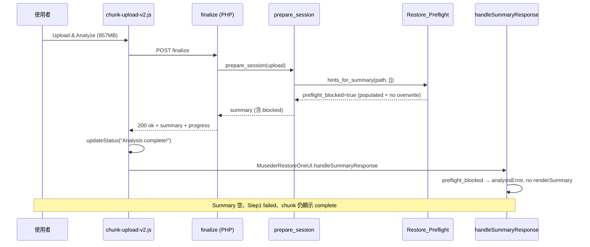

# Bug 調查報告：musederlabs.com Step 1「Analysis failed」（2.7.269 第三次仍失敗）

| 項目 | 內容 |
|------|------|
| **站點** | https://musederlabs.com/ |
| **主機文件根目錄** | `/home/eo8lmixijvfj/public_html/musederlabs.com_OFF` |
| **外掛版本（SSH 已確認）** | **2.7.269**（`Version: 2.7.269` / `MUSEDER_RESTOREONE_BUILD_ID`） |
| **PHP** | 8.3.31（ionCube + OPcache） |
| **WP table prefix（本次）** | `cwfv_`（新安裝測試站；前次調查為 `hs0r_`） |
| **備份檔** | `musederlabs.com-20251225005505-PIQo5C.zip`（858 MB；截圖 OCR 可能寫成 `PJQo5C`） |
| **SHA1（截圖與日誌一致）** | `fb89f1309427d85b74fa1d20c00c4b9bcb3d2aaa` |
| **嚴重度** | **P1** — Step 2 鎖定，還原無法繼續 |
| **調查日期** | 2026-05-29 |
| **調查方式** | SSH 唯讀（未改主機／站點任何檔案） |
| **前案** | `docs/BUG-INVESTIGATION-2026-05-28-…`（153 MB）、`docs/BUG-INVESTIGATION-2026-05-29-…PIQo5C.md`（2.7.268 Load Info） |

---

## 1. 問題摘要（使用者可見 — 與截圖一致）

使用者以 **Step 1 – Upload & Analyze** 上傳約 **857 MB** 備份後，畫面同時出現：

| UI 區塊 | 顯示 | 語意 |
|---------|------|------|
| Chunk 進度區 | `Analysis complete!` | 分塊上傳／finalize 路徑自認成功 |
| SHA1 | Server / Client **一致**（`fb89f130…`） | 合併與校驗通過 |
| **Step 1 角標** | `Analysis failed. Try again.` | 精靈狀態機判定失敗 |
| **File Summary** | `Please select a backup file to restore.` | **無摘要**（空白） |
| Step 2 | 鎖定 | `hasAnalyzed === false` |

**與同日稍早 2.7.268 調查之差異：** 268 案例曾出現 Summary **已填入** + Step 1 failed（多為 Load Info 路徑）；**本案 2.7.269 回到「Analysis complete + Summary 空 + 精靈 failed」**，與 2026-05-28 舊案 UI 型態相同。

使用者註記：**第三次修改後仍失敗**（2.7.267 preflight → 2.7.268 token/JS → 2.7.269 Step1 cache + JS 優先順序）。

---

## 2. 主機證據（2.7.269）

### 2.1 外掛與部署

```
Version: 2.7.269
Author: Adrian Lin
```

線上 `chunk-upload-v2.js` 已含 **2.7.269 宣稱的修復**（優先 `MusederRestoreOneUI`）：

```text
457:  window.MusederRestoreOneUI.handleSummaryResponse  // Method 1 優先
470:  window.BackupLiteUI.handleSummaryResponse         // Method 2 備援
498:  backup-lite-summary-ready                          // Method 4 事件
```

線上 `admin.js` 含 2.7.269 的 `summaryMatchesSelectedFilename` / `applyCachedSummaryForSelectedFile`（Load Info 快取路徑）。

### 2.2 日誌時間軸（`backup-lite-2026-05-29.log`，UTC）

| 時間 | 事件 |
|------|------|
| 08:02:33 | 2.7.269 啟用、OPcache 失效 |
| 08:04:50 | `PREPARE_V2_OK` — 429 chunks，898801827 bytes，`PIQo5C.zip` |
| 08:40:22 | `FINALIZE_V2_START` |
| 08:41:50 | `FINALIZE_V2_OK` — SHA1 `fb89f130…` |
| 08:41:50 | Large file — skip SHA1（>500MB） |
| 08:42:05 | DB prefix `mxmc_` → **`cwfv_`** |
| 08:42:06 | **`PREPARE_SESSION_OK after finalize`** |

**截圖工作列 2026/5/29 16:42（UTC+8）= 08:42 UTC**，與 `PREPARE_SESSION_OK` **秒級吻合**。

### 2.3 日誌中未出現

- `Failed to prepare restore session`
- `[ERROR]`
- `Restore prepare: reusing cached summary analysis`（本案為首次 chunk finalize，屬正常）

**伺服器結論：** 本案 **後端 chunk finalize + `prepare_session()` 成功**；問題在 **前端精靈未進入「已分析」**，而非上傳／合併失敗。

---

## 3. 2.7.269 已宣稱修復 vs 現場結果

`readme.txt` **2.7.269** changelog：

1. 大檔 **Load Info** 重用快取，避免重掃 ZIP 逾時  
2. Load Info 失敗時不再顯示 stale Summary  
3. Chunk finalize **優先**呼叫 `MusederRestoreOneUI.handleSummaryResponse`

| 修復項 | 本案是否適用 | 現場 |
|--------|--------------|------|
| (1) 分析快取 | 主要針對 **Load Info** | 本案為 **chunk 上傳**，finalize 仍完整跑 `prepare_session`（日誌可見） |
| (2) Load Info stale Summary | 不適用 | 本案 Summary **空白**，非 stale |
| (3) MusederRestoreOneUI 優先 | **適用** | 程式已部署，但 **Step 1 仍 failed** → 修復未涵蓋真正觸發條件 |

---

## 4. 根因分析（2.7.269，供開發 Agent）

### 4.1 【最高信心】`handleSummaryResponse` 因 `preflight_blocked` 將 Step 1 判為失敗

**UI 指紋與程式完全吻合：**

| 現象 | 程式行為 |
|------|----------|
| Chunk 區顯示 `Analysis complete!` | `chunk-upload-v2.js` 在呼叫 `handleSummaryResponse` **之前**已 `updateStatus('Analysis complete!')` |
| File Summary **空白** | `upload-start` 已 `renderSummary(null)`；`handleSummaryResponse` 在 `preflight_blocked` 時 **early return，不呼叫 `renderSummary`** |
| Step 1 `Analysis failed` | `preflight_blocked` 分支設 `analysisError=true`、`hasAnalyzed=false` |
| **未**觸發 `upload-failed` | Chunk 進度文字**保留**（`upload-failed` 會清空 `.backup-lite-progress-status`） |

相關程式：

```4975:4984:assets/js/admin.js
            if (payload.summary) {
                if (payload.summary.preflight_blocked) {
                    isAnalyzing = false;
                    analysisError = true;
                    hasAnalyzed = false;
                    syncWizard();
                    notifyError({ message: payload.summary.preflight_message || ... });
                    ...
                    return;
                }
```

**後端：** `compose_summary()` 會合併 `Museder_Restoreone_Restore_Preflight::hints_for_summary( $path, [] )`，其中 `preflight_blocked` 來自 **空 options** 的 preflight（`overwrite` 未設 → 視為 false）。

**觸發條件（程式邏輯）：** `detect_restore_profile()` 回傳 **`populated_wp`**，且 `restore_scope=full`、未勾選 overwrite：

```172:177:includes/class-restore-preflight.php
        if ( self::PROFILE_POPULATED === $profile ) {
            ...
            if ( empty( $options['overwrite'] ) && self::SCOPE_FULL === $options['restore_scope'] ) {
                $blocked = true;
                $message = __( 'Full-site restore on a site with existing content requires enabling "Overwrite existing data".', ... );
```

**測試站為何常被誤判為 `populated_wp`：**

```117:121:includes/class-restore-preflight.php
        $plugins = get_option( 'active_plugins', [] );
        ...
        if ( $plugin_count > 2 ) {
            return self::PROFILE_POPULATED;
        }
```

新安裝站若啟用 **>2 個外掛**（例如 Akismet + Hello Dolly + **Museder RestoreOne**），或 `uploads/` 內已有年度目錄與檔案（本插件備份／日誌亦會寫入），即可能被判為 **populated**，即使實務上是「測試用乾淨站」。

**與日誌一致：** 伺服器 `PREPARE_SESSION_OK` 只表示 `prepare_session()` 完成並回傳 summary JSON（**可含** `preflight_blocked: true`）；**不代表** Step 1 精靈應解鎖。

---

### 4.2 【中信心】Step 1 與 Step 2 preflight 語意混淆（2.7.267+ 設計問題）

- **Preflight「blocked」** 語意是：**在尚未勾選 Step 2 選項（overwrite 等）時，不應執行還原**。  
- **現狀：** 同一 `preflight_blocked` 在 **Step 1 分析階段** 就讓 `handleSummaryResponse` 失敗，導致：
  - 使用者看不到檔案摘要、DB prefix、profile 提示  
  - 無法進入 Step 2 勾選 **Overwrite existing data** 以解除 block  

這解釋了「**第三次修改**」仍失敗：2.7.269 修了 JS 串接與 Load Info 快取，**未改** Step 1 對 `preflight_blocked` 的處理策略。

---

### 4.3 【低信心／本案次要】Chunk `handleSummaryResponse` 未掛載

2.7.269 已優先 `MusederRestoreOneUI`；若完全未呼叫 handler，精靈多半顯示 **Analyzing…**（`isAnalyzing=true`），而非 **Analysis failed**。  
本案指紋更符合 **§4.1 已呼叫但 blocked**。

若開發需排除：在瀏覽器 Console 查 `[Finalize] Calling handleSummaryResponse via window.MusederRestoreOneUI` 與 Network 中 finalize 回應 JSON 是否含 `summary.preflight_blocked`。

---

### 4.4 【已排除】

| 假設 | 理由 |
|------|------|
| Chunk 合併／SHA1 失敗 | `FINALIZE_V2_OK`，SHA1 與截圖一致 |
| 外掛版本錯誤 | 主檔與日誌均 2.7.269 |
| 僅 Load Info 逾時 | 本案按鈕為 **Upload & Analyze**，日誌為 **PREPARE_V2 / FINALIZE_V2** 路徑 |
| `upload-failed` 事件 | 會清空 chunk「Analysis complete」文字；截圖仍保留 |

---

## 5. 架構圖（本案實際路徑）



---

## 6. 與歷次調查對照

| 版本 / 報告 | 主要症狀 | 主因方向 |
|-------------|----------|----------|
| 2.7.268 前（5/28） | complete + 空 Summary + failed | JS 未更新精靈（BackupLiteUI 優先） |
| 2.7.268（5/29 早） | **有 Summary** + failed | Load Info AJAX 逾時 + stale Summary |
| **2.7.269（本案）** | complete + **空 Summary** + failed | **`preflight_blocked` 在 Step 1 當成分析失敗**；profile 誤判 populated |

---

## 7. 建議開發 Agent 驗證步驟（不含修復方案）

1. **Network：** 擷取 `POST .../wp-json/museder-restoreone/v2/finalize` 回應，確認 `summary.preflight_blocked`、`preflight_message`、`restore_profile`。  
2. **Console：** 是否有 `[Finalize] Calling handleSummaryResponse via window.MusederRestoreOneUI` 與 `notifyError` 訊息（overwrite 相關）。  
3. **WP-CLI / 一次性 PHP（測試環境）：**  
   - `Museder_Restoreone_Restore_Preflight::detect_restore_profile()`  
   - `hints_for_summary( $zip, [] )` 的 `preflight_blocked`  
4. **產品決策（需人類確認）：** Step 1 是否應 **永遠顯示 summary** 並僅在 Step 3 執行前 respect `preflight_blocked`？  
5. **Profile 調優：** `plugin_count > 2` 是否應排除預設外掛或 museder-restoreone 本體，避免測試站誤判 populated。

---

## 8. 調查結論

1. **2.7.269 已正確部署**，且 **伺服器在 08:42 UTC 成功完成 857 MB 備份分析**（與截圖 SHA1、時間一致）。  
2. **P1 為前端／產品邏輯問題**，非上傳或 finalize 失敗。  
3. **最可能根因（2.7.269）：** `compose_summary()` 帶入的 **`preflight_blocked: true`**（`populated_wp` + 未選 overwrite）使 `handleSummaryResponse` 將 Step 1 標為失敗且不渲染 Summary；chunk 層仍顯示 **Analysis complete!**，形成矛盾 UI。  
4. **2.7.269 changelog 的三項修復未覆蓋此路徑**，故使用者「第三次修改後仍失敗」與證據一致。  
5. 修復與測試案例應由開發 Agent 在 repo 內進行；本報告僅供 debug 輸入。

---

## 9. 附錄：關鍵檔案

| 路徑 | 說明 |
|------|------|
| `assets/js/chunk-upload-v2.js` | finalize 後 `Analysis complete!` 與 `handleSummaryResponse` 呼叫順序 |
| `assets/js/admin.js` | `handleSummaryResponse`、`preflight_blocked` 分支、`upload-start` / `upload-failed` |
| `includes/class-restore-handler.php` | `prepare_session`、`summary_cache`（2.7.269） |
| `includes/class-restore-preflight.php` | `detect_restore_profile`、`preflight` blocked 條件 |
| `includes/class-chunk-handler-v2.php` | `PREPARE_SESSION_OK after finalize` 日誌 |

---

*調查方式：SSH 唯讀；報告不含主機密碼。使用者表示任務後將輪換憑證。*
