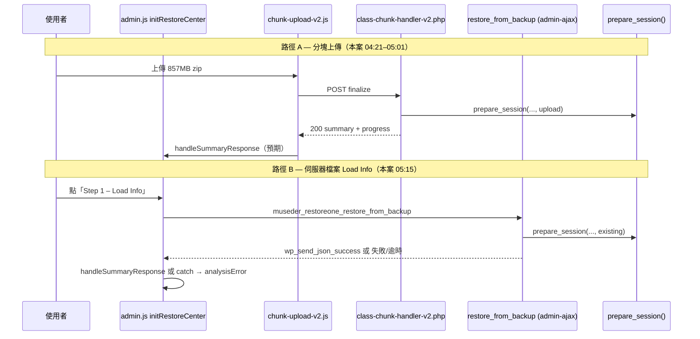

# Bug 調查報告：musederlabs.com Step 1「Analysis failed」＋ File Summary 已填入（857 MB 備份）

| 項目 | 內容 |
|------|------|
| **站點** | https://musederlabs.com/ |
| **主機文件根目錄** | `/home/eo8lmixijvfj/public_html/musederlabs.com_OFF` |
| **外掛版本（已確認）** | **2.7.268**（`museder-restoreone.php` + 日誌 `build_id`） |
| **PHP** | 8.3.31（ionCube + OPcache）；CLI `memory_limit=128M` |
| **WP table prefix** | `hs0r_` |
| **備份檔** | `musederlabs.com-20251225005505-PIQo5C.zip`（約 **858 MB / 857.16 MB 顯示**） |
| **備份檔註記** | 截圖 OCR 可能顯示為 `PJQo5C`；主機實際檔名為 **`PIQo5C`** |
| **DB prefix（日誌）** | `mxmc_` → `hs0r_`（截圖若顯示 `mxnc_` 應為顯示／OCR 誤差） |
| **嚴重度** | **P1** — Step 2 鎖定，還原流程無法繼續 |
| **調查日期** | 2026-05-29 |
| **調查方式** | SSH 唯讀取證（未修改主機任何檔案或程式碼） |
| **相關舊案** | `docs/BUG-INVESTIGATION-2026-05-28-musederlabs-step1-analysis-failed.md`（153 MB、Summary 空白、chunk finalize 與精靈分裂） |

---

## 1. 問題摘要（使用者可見）

使用者於 Restore 精靈 **Step 1** 在備份已上傳／已選定後，畫面呈現**矛盾狀態**：

| UI 區塊 | 實際顯示 | 語意 |
|---------|----------|------|
| **File Summary** | 檔名、857.16 MB、`Source: upload`、DB prefix 對照 | 後端已能組出摘要資料 |
| **Step 1 角標**（`#step-upload-status`） | `Analysis failed. Try again.` | 精靈狀態機判定 Step 1 失敗 |
| **Step 2** | 鎖定 | `hasAnalyzed === false` |

與 **2026-05-28 舊案**的差異：舊案 Summary 為空、chunk 進度列顯示 `Analysis complete!`；**本案 Summary 有內容，但 Step 1 仍為 error**。

---

## 2. 主機環境（已核實）

| 項目 | 值 |
|------|-----|
| SSH 主機 | `118.139.182.16:22`（GoDaddy `sg2plzcpnl509401.prod.sin2.secureserver.net`） |
| 站點目錄 | `public_html/musederlabs.com_OFF`（addon domain 結構） |
| 外掛路徑 | `.../wp-content/plugins/museder-restoreone/` |
| 備份目錄 | `.../wp-content/uploads/museder-restoreone/backups/` |
| 日誌 | `.../wp-content/uploads/museder-restoreone/logs/backup-lite-2026-05-29.log` |
| 備份檔存在 | `-rw-r--r-- 858M May 28 22:01 ...PIQo5C.zip` |
| `debug.log` | 站點 `wp-content/debug.log` **不存在**；僅 `error_log` 有本次調查產生的 PHP CLI 測試訊息 |

---

## 3. 伺服器日誌時間軸（`backup-lite-2026-05-29.log`）

以下為與本案直接相關事件（UTC）：

| 時間 (UTC) | 事件 | 解讀 |
|------------|------|------|
| 04:11:34 | 2.7.268 啟用／OPcache 失效 | 外掛版本確認 |
| 04:21:41 | `PREPARE_V2_OK` — **429 chunks**，898801827 bytes，`PIQo5C.zip` | 分塊上傳 session 建立（約 857 MB） |
| 04:59:51 | `FINALIZE_V2_START` | 開始 finalize（合併 + SHA1） |
| 05:01:19 | `FINALIZE_V2_OK` — SHA1 `fb89f130...` 與 client 一致 | 合併與校驗成功 |
| 05:01:19 | `Large file detected, skipping SHA1...` | `prepare_session()` 大檔路徑（>500MB 跳過 sha1_file） |
| 05:01:33 | `Restore prepare: detected DB prefixes` — `mxmc_` → `hs0r_` | 前綴偵測完成 |
| 05:01:34 | **`PREPARE_SESSION_OK after finalize`** | **REST finalize 路徑：後端分析成功並回傳 summary** |
| 05:12:02 | `Museder RestoreOne build active` | 使用者可能重新載入後台頁面 |
| **05:15:08** | `Large file detected, skipping SHA1...`（同檔） | **`restore_from_backup`（Step 1 – Load Info）AJAX 開始** |
| **05:15:22** | `Restore prepare: detected DB prefixes`（同檔） | `prepare_session()` 至少執行到前綴偵測 |
| 05:15:22 之後 | **無** `Failed to prepare restore session`、**無** `[ERROR]`、**無** 第二次 `PREPARE_SESSION_OK` | AJAX 可能**未正常結束**（逾時／fatal／空回應） |

**關鍵結論（伺服器端）：**

1. **Chunk 上傳 + REST finalize（05:01）在伺服器端已成功完成分析**，並寫入 restore state（`source: upload` 與 Summary 一致）。
2. 截圖時間（本機約 13:15 = **UTC 05:15**）與 **05:15:08 Load Info** 日誌吻合；本案最可能為 **「伺服器檔案 + Load Info」路徑失敗**，而非單純「上傳未完成」。
3. Load Info 請求在 prefix 日誌之後**沒有**對應的成功／例外日誌 → 高度懷疑 **`compose_summary()` / preflight 階段**或 **Web SAPI 逾時**導致連線中斷，而非 `prepare_session` 開頭失敗。

---

## 4. 架構與程式路徑（2.7.268）

### 4.1 兩條 Step 1 分析路徑



| 路徑 | 觸發 | 後端入口 | 前端處理 |
|------|------|----------|----------|
| **A** | `#backup-lite-restore-form-v2` 分塊上傳 | REST `v2/finalize` | `chunk-upload-v2.js` → `handleSummaryResponse` |
| **B** | `#selectRestore`（Load Info） | `wp_ajax_museder_restoreone_restore_from_backup` | `admin.js` `ajaxRequest` → `handleSummaryResponse` |

### 4.2 Step 1 角標「Analysis failed」來源

`admin.js` → `syncWizard()`：

- `analysisError === true` → 文案 `stepUploadError` = **「Analysis failed. Try again.」**
- `hasAnalyzed === true` → 解鎖 Step 2

`analysisError` 在 **Load Info 的 `catch`** 會被設為 `true`（約 L5309–5312），且 **不會清除已顯示的 File Summary**。

### 4.3 頁面載入時 Summary 與精靈狀態

```javascript
// admin.js initRestoreCenter 初始化
var hasAnalyzed = !!(restoreData.summary && (restoreData.summary.name || restoreData.summary.size));
var analysisError = false;

// 頁尾
if (restoreData.summary) {
    renderSummary(restoreData.summary);  // 顯示 Summary
}
syncWizard();  // 若有 summary → hasAnalyzed=true → Step 1 應為 done
```

**矛盾狀態的合理解釋（與本案時間軸一致）：**

1. **05:01** chunk finalize 成功 → PHP 已寫入 `museder_restoreone_restore_state`，`source=upload`。
2. **05:12** 使用者重新載入頁面 → PHP 注入 `restoreData.summary` → **File Summary 顯示正常**，Step 1 理應為 **done**。
3. **05:15** 使用者再次點 **Load Info**（重試或誤操作）→ JS 先設 `hasAnalyzed=false`，發起 AJAX。
4. AJAX **失敗或逾時**（見 §5.2）→ `catch` 設 `analysisError=true`，**但未呼叫 `renderSummary(null)`** → DOM 仍保留步驟 2 之前的 Summary。
5. 結果：**Summary 有內容 + Step 1 顯示 failed** — 與截圖一致。

---

## 5. 根因分析（供開發 Agent debug）

### 5.1 【高信心】前端狀態機：失敗時未清除 stale Summary（2.7.268 產品缺陷）

**位置：** `assets/js/admin.js` — `#selectRestore`（Load Info）`catch` 區塊（約 L5309–5320）。

| 行為 | Load Info 成功 | Load Info 失敗（catch） |
|------|----------------|-------------------------|
| `analysisError` | `false`（經 `handleSummaryResponse`） | **`true`** |
| `hasAnalyzed` | `true` | **`false`** |
| `renderSummary` | 更新為新 summary | **未清除** → 舊 Summary 留在畫面上 |

對比：`backup-lite-restore-upload-failed` 事件處理（L5057–5084）**會** `renderSummary(null)` 並清空 `restoreData.summary`。

**影響：** 只要伺服器 state 或前次 render 已有 summary，任何後續 Load Info 失敗都會產生 **「Summary 看起來成功、精靈卻 failed」** 的假陽性 UI，誤導使用者與 QA。

**與版本關係：** 2.7.268 既有行為；非主機設定問題。

---

### 5.2 【高信心】Load Info（admin-ajax）在 857 MB 備份上可能逾時或無回應（2.7.268 + 大檔路徑）

**證據：**

- 05:15:08–05:15:22 僅有 `prepare_session` 前段日誌（大檔跳過 SHA1、prefix 偵測）。
- **沒有** `Failed to prepare restore session`（`restore_from_backup` 的 `catch` 才會寫）。
- **沒有** 後續成功標記（`restore_from_backup` 本身不寫 `PREPARE_SESSION_OK`，但正常應 `wp_send_json_success` 讓前端解鎖）。

**`prepare_session()` 在 prefix 日誌之後仍會執行：**

1. `set_state()`
2. `compose_summary()` → 再次 `ZipArchive` 列出項目（`detect_db_payload_from_archive`）
3. `Museder_Restoreone_Restore_Preflight::hints_for_summary()` → `preflight()` → **`zip_archive_has_wp_core()`** 等（又一次掃描 857 MB zip 目錄）

**05:01 REST finalize 能完成**，不代表 **admin-ajax** 有相同時間預算：共享主機常對 `admin-ajax.php` 設較短的 FastCGI / proxy timeout，而長時間 REST 請求可能走不同限制。

**前端 `ajaxRequest` 行為：** 回應為 `0`、非 JSON、HTTP 非 2xx、`success:false` 皆會 **throw** → 進入 Load Info `catch` → `Analysis failed`（§5.1 放大矛盾 UI）。

**建議開發驗證：**

- 瀏覽器 Network 重現：記錄 `action=museder_restoreone_restore_from_backup` 的 **HTTP 狀態、回應體、耗時**。
- 在 `compose_summary` / `hints_for_summary` 前後加 **計時 log**（僅 dev 分支）。
- 比較 **REST finalize** vs **admin-ajax** 的 `max_execution_time` 與反向代理 timeout。

---

### 5.3 【中信心】Chunk finalize 路徑：2.7.268 仍優先查 `BackupLiteUI`（與舊案同源，但本案伺服器已成功）

線上部署檔（已 grep）：

```text
chunk-upload-v2.js:457  window.BackupLiteUI.handleSummaryResponse  // Method 1，優先
admin.js:5025–5029      同時掛載 MusederRestoreOneUI + BackupLiteUI
admin.js:1885           backup-lite-summary-ready 事件備援
```

2.7.268 已透過 `exposeHandleSummaryResponse()` 將 handler 掛到 **`BackupLiteUI`**，理論上 Method 1 可用；且本案 **05:01 `PREPARE_SESSION_OK`** 證明 REST 路徑成功。

**但若**使用者在 **05:01 後未重新載入**、且 JS 整合仍因例外未呼叫 `handleSummaryResponse`，可能先看到 failed，再靠 reload 才出現 Summary — 與 05:12 reload 日誌一致。

**建議：** `chunk-upload-v2.js` 應 **優先** `MusederRestoreOneUI`（與舊案報告建議相同），並在 finalize 後 assert `hasAnalyzed` 或強制 `syncWizard()`。

---

### 5.4 【低信心／已排除為主因】`preflight_blocked`

`handleSummaryResponse` 若收到 `preflight_blocked` 會設 `analysisError=true` 且 **不** `renderSummary`（L4948–4956）。本案為 fresh install 站，且 chunk finalize 已成功 `compose_summary`，**blocked 非首選根因**。若 Load Info 曾短暫成功後又被 blocked，需 Network JSON 佐證。

---

## 6. 與 2026-05-28 舊案對照

| 維度 | 2026-05-28（YN0vkA，153 MB） | 2026-05-29 本案（PIQo5C，857 MB） |
|------|------------------------------|-----------------------------------|
| 上傳方式 | Chunk v2 | Chunk v2（429 塊） |
| 伺服器 finalize | `FINALIZE_V2_OK` + prefix | 同左 + **`PREPARE_SESSION_OK`** |
| File Summary | **空白** | **已填入**（upload、prefix） |
| 使用者操作 |  primarily 上傳後即失敗 | 上傳成功後 **05:15 Load Info** 失敗特徵 |
| 主因假設 | chunk → 精靈未 `handleSummaryResponse` | **Load Info AJAX 失敗 + UI 不清 Summary**；大檔 `compose_summary` 耗時 |
| 2.7.268 修復狀態 | 報告稱已修；線上仍有 BackupLiteUI 優先順序 | `BackupLiteUI` alias 存在，但大檔 + 雙路徑仍暴露問題 |

---

## 7. 已排除或非本案主因

| 假設 | 結論 |
|------|------|
| 備份檔不存在 | 已存在於 backups 目錄（858 MB） |
| 外掛版本非 2.7.268 | 主檔與日誌均為 2.7.268 |
| Chunk 合併／SHA1 失敗 | `FINALIZE_V2_OK`，client/server SHA1 一致 |
| 還原 job 已寫入 history | `restore-history.json` 仍為空（未進入 Step 3） |
| DB prefix 完全無法偵測 | 日誌有 `mxmc_` → `hs0r_` |

---

## 8. 建議開發 Agent 的 Debug 清單（僅調查／驗證，非修復方案）

### 8.1 必做重現驗證

1. **Network（Load Info）**  
   - 選 `musederlabs.com-20251225005505-PIQo5C.zip` → 點 **Step 1 – Load Info**。  
   - 記錄：`admin-ajax.php` 耗時、HTTP code、body（是否 `0`、502、JSON `success:false`）。

2. **Network（Chunk finalize）**  
   - 上傳同檔後看 REST `finalize` 回應是否含 `summary` + `progress`；Console 是否有 `[Finalize]` / `handleSummaryResponse` 日誌。

3. **Console**  
   - 是否觸發 `backup-lite-restore-upload-failed` 與 Load Info `catch` 交錯。

### 8.2 後端計時（建議暫時 log）

在 `Museder_Restoreone_Restore_Handler::prepare_session()` 與 `compose_summary()` 對 **>500MB** 檔案分段記錄：

- `detect_db_prefix_from_archive`
- `detect_db_payload_from_archive`
- `Restore_Preflight::hints_for_summary` / `zip_archive_has_wp_core`

對照 05:15 僅 14 秒出現 prefix 後「沉默」的現象。

### 8.3 前端（2.7.268）

| 檔案 | 檢查點 |
|------|--------|
| `admin.js` | Load Info `catch` 是否應清除或重載 summary；`hasAnalyzed` 與 `restoreData.summary` 一致性 |
| `chunk-upload-v2.js` | 改為優先 `MusederRestoreOneUI`；finalize 後驗證 `syncWizard()` |
| `class-restore-handler.php` | 大檔 `compose_summary` 是否重複全 zip 掃描；可否快取至 state 避免 Load Info 重掃 |

### 8.4 主機（選做）

- 查 cPanel **`max_execution_time`**、PHP-FPM、`mod_fcgid` / LiteSpeed 對 `admin-ajax.php` 限制。  
- 本案 CLI `max_execution_time=0` **不代表** Web 請求限制。

---

## 9. 調查結論（給產品／開發）

1. **伺服器在 2.7.268 下已成功分析 857 MB 備份（chunk finalize，05:01 UTC）**；備份檔與 restore state 具備繼續還原的資料基礎。  
2. **使用者截圖狀態（Summary 有 + Step 1 failed）不符合「後端完全無法解析」**，而是 **2.7.268 Restore 精靈前端狀態與 AJAX 結果不同步** 的典型表現。  
3. **最可能觸發鏈（按信心排序）：**  
   - **(A)** Load Info 對大檔 `prepare_session`/`compose_summary` **逾時或無回應** → `ajaxRequest` throw → `analysisError=true`；  
   - **(B)** **Load Info 失敗時未清除 stale Summary** → 矛盾 UI；  
   - **(C)** 若未 reload，chunk 路徑 JS 整合仍可能未解鎖精靈（次要，因 05:01 後有 reload 跡象）。  
4. **本案與 Docker QA 第五輪 Pass 不矛盾**：QA 環境檔案較小、路徑／timeout 不同；**線上 857 MB + admin-ajax Load Info** 仍為 2.7.268 發佈風險點。  
5. **修復應由開發 Agent 在 repo 內實作**；本報告刻意不包含 patch 內容。

---

## 10. 附錄：關鍵檔案索引

| 路徑 | 用途 |
|------|------|
| `assets/js/admin.js` | `initRestoreCenter`、`syncWizard`、`handleSummaryResponse`、Load Info `#selectRestore` |
| `assets/js/chunk-upload-v2.js` | 分塊 finalize → `handleSummaryResponse` / 事件 |
| `includes/class-restore-handler.php` | `restore_from_backup`、`prepare_session`、`compose_summary` |
| `includes/class-chunk-handler-v2.php` | REST finalize、`PREPARE_SESSION_OK` 日誌 |
| `includes/class-restore-preflight.php` | `hints_for_summary` → 大 zip 掃描 |
| `templates/page-restore.php` | Step 1 UI、`#selectRestore`、`#fileSummary` |
| `docs/BUG-INVESTIGATION-2026-05-28-musederlabs-step1-analysis-failed.md` | 前案（153 MB、Summary 空） |

---

## 11. 調查限制

- 未修改主機檔案；未登入 WordPress 後台擷取 Network HAR（建議使用者或開發 Agent 補抓）。  
- `museder_restoreone_restore_state` 資料庫內容因 PowerShell／遠端 quoting 未能在此報告內嵌完整 JSON；但日誌與 Summary 欄位（`source: upload`、檔名、大小、prefix）已足以證明 state 曾成功寫入。  
- 報告**不包含**任何主機密碼；使用者已表示任務後會輪換憑證。

---

*報告產生：調查 Agent（唯讀 SSH + 原始碼靜態分析），供開發 Agent 進行 2.7.268 debug。*
