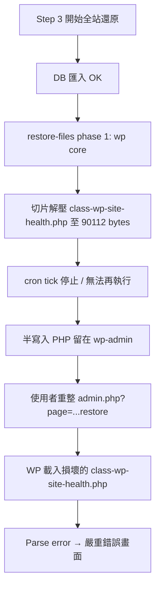

# Bug 調查報告：shineching.com Step 3 還原失敗 → 後台嚴重錯誤（2.7.273）

| 項目 | 內容 |
|------|------|
| **站點** | https://shineching.com/ |
| **Docroot（唯一調查範圍）** | `/home/qj8hea4vdto3/public_html/shineching.com` |
| **主機** | GoDaddy shared，`132.148.179.46`，SSH 使用者 `qj8hea4vdto3` |
| **外掛版本（SSH 已確認）** | **2.7.273**（`Version: 2.7.273` / build log `build_id: 2.7.273`） |
| **PHP / WP** | PHP 8.3.30（web）；WordPress **7.0**（validation meta） |
| **還原 Job ID** | `rjb_20260531_023304_fapjq2` |
| **還原來源檔** | `shineching.com-20260531013823-V6yYBa-1.zip`（564.71 MB；SHA1 `76c01c2f9f06067cd961dc4facd7812b28b45610`） |
| **還原前快照** | `shineching.com-20260531023307-WPKJjN.zip`（604.94 MB，自動 pre-restore backup） |
| **嚴重度** | **P0** — Step 3 還原中斷、站點 core 檔案半寫入損壞、後台無法進入 Restore 頁 |
| **調查日期** | 2026-05-31（UTC 取證） |
| **調查方式** | SSH **唯讀**（未改 docroot 內任何檔案或程式碼） |
| **前案** | musederlabs Step 3 中斷（2.7.270，`docs/BUG-INVESTIGATION-2026-05-29-musederlabs-step3-restore-interrupted-2.7.270.md`） |

---

## 1. 問題摘要（使用者可見）

1. **Step 3 – Execute Restore（使用者稱 P3）** 執行全站還原（564 MB 備份）時，進程**失敗／中斷**。
2. **重整瀏覽器** 後，開啟  
   `https://shineching.com/wp-admin/admin.php?page=museder-restoreone-restore`  
   出現 WordPress **「這個網站發生嚴重錯誤」**（截圖時間約 2026-05-31 02:39 UTC+8）。

**重要：** 後台嚴重錯誤**不是** RestoreOne 外掛 PHP fatal 直接造成，而是 **WordPress core 檔案在還原過程中被「切片解壓中斷」後半寫入損壞**，導致 `wp-admin` 載入時 Parse error。

---

## 2. 時間線（UTC+8，來自 `backup-lite-2026-05-31.log` 與 `error_log`）

| 時間 (UTC+8) | 事件 |
|--------------|------|
| 01:43:14 | 測試備份完成 `shineching.com-20260531013823-V6yYBa.zip`（564.71 MB） |
| 02:32:46 | 還原 prepare／finalize（chunk upload `V6yYBa-1.zip`） |
| 02:33:04 | `Restore job prepared` — `rjb_20260531_023304_fapjq2` |
| 02:33:07 | validated；pre-restore snapshot 開始 |
| 02:34:35 | pre-restore snapshot 完成 `WPKJjN.zip`（604.94 MB） |
| 02:35:19 | DB 匯入完成；**Mid-restore plugin isolation** 啟用（MU guard 安裝） |
| 02:35:35 | `restore-files`：self-protect skipped 5 個 RestoreOne 檔 |
| 02:36:35 | `restore-files`：self-protect skipped 累計 73 個 RestoreOne 檔 |
| **02:36:40** | job `last_tick` **最後更新**（UTC 18:36:40）— **之後無新 tick** |
| **02:37:29 起** | `error_log` 連續 **Parse error**：`wp-admin/includes/class-wp-site-health.php:2692` |
| 02:39 左右 | 使用者重整 Restore 頁 → 嚴重錯誤畫面（與 Parse error 一致） |
| 02:41:30 | 外掛 build log `2.7.273`（僅 MU isolation 下 RestoreOne 載入時寫入） |

---

## 3. 主機證據（2.7.273，唯讀）

### 3.1 Job meta（`jobs/rjb_20260531_023304_fapjq2.json`）

| 欄位 | 值 | 解讀 |
|------|-----|------|
| `stage` | **`restore-files`** | 卡在檔案解壓階段 |
| `progress` | **85** | UI 顯示偏高（見 §5.2） |
| `message` | Restoring WordPress core and site root files… | **Phase 1**（wp-admin / wp-includes / site root） |
| `completed` | `false` | 還原未結束 |
| `tick_source` | `cron` | 由 WP-Cron 切片驅動 |
| `last_tick` | `1780166200`（UTC 18:36:40） | **已停滯** |
| `checkpoints.zip_files_phase` | **1** | wp-content 階段已完成，正在 core |
| `checkpoints.zip_index` | **1080** / **16808** | 約 **6.4%** ZIP 條目 |
| `checkpoints.zip_entry_offset` | **90112** | **關鍵：目前條目內 byte offset** |
| `options.files_only` | `false` | **全站還原**（含 DB） |
| `options.restore_order` | `db_then_files` | 先 DB 後檔案 |
| `options.wp_config_mode` | `backup` | 會從備份覆寫 wp-config |
| `options.pause_other_plugins` | `true` | safe mode |
| `validation.checksum.ok` | `true` | 來源 ZIP checksum 驗證通過 |

**無 `error` 欄位、日誌無 `[ERROR]`** — job 以 **`running` + 停滯 checkpoint** 狀態掛起，未標記 failed。

### 3.2 損壞檔案（決定性證據）

| 路徑 | 磁碟大小 | 備份 ZIP 內大小 | 狀態 |
|------|----------|-----------------|------|
| `wp-admin/includes/class-wp-site-health.php` | **90,112 bytes** | **131,241 bytes** | **截斷**；`php -l` **Parse error**；檔尾停在 `'des`（`description` 未完成） |
| 備份 ZIP 本體 | — | — | `unzip -t` on server **通過**（來源 archive 無問題） |

**`zip_entry_offset`（90112）= 磁碟上 `class-wp-site-health.php` 大小（90112）** → 可確認 job 在解壓**此檔案中途**被切片時間 budget 切斷，且**下一 tick 未再續傳**。

### 3.3 `error_log`（`public_html/shineching.com/error_log`）

```
[30-May-2026 18:37:29 UTC] PHP Parse error: syntax error, unexpected string content "des", expecting ")"
  in .../wp-admin/includes/class-wp-site-health.php on line 2692
（18:41:30、18:41:31、18:41:55 重複）
```

此 Parse error 會觸發 WordPress 5.2+ **critical error** 畫面（與使用者截圖一致）。

### 3.4 還原附帶狀態

| 項目 | 狀態 |
|------|------|
| `restore-history.json` | `result: "running"`（未完成） |
| `temp/.../run.lock` | 存在 |
| `mu-plugins/museder-restoreone-restore-isolation.php` | **仍存在**（mid-restore isolation 未退出） |
| `wp-config.php` `$table_prefix` | **`pa7a_`**（還原後 DB prefix；與 job options 一致） |
| WP-Cron `museder_*` events | 調查時 **`wp cron event list \| grep museder` 無結果** |

### 3.5 備份／還原 ZIP 完整性（排除「備份壞檔」）

- 測試備份 job `900d4241-bc23-4cbf-b641-8426fc88aa6d`：`verify ok:true, structural_ok:true`（2.7.273 verify 路徑正常）。
- 還原來源 `V6yYBa-1.zip`：prepare checksum **ok**。
- **結論：不是 2.7.273 打包產生壞 ZIP**，而是 **還原解壓執行中斷 + 半寫入**。

---

## 4. 根因分析

### 4.1 【決定性】切片解壓在中途停止，留下半寫入 core 檔 → 後台 Parse error

**程式路徑（2.7.273，`includes/class-restore-service.php`）：**

`stage_restore_files()` → `extract_zip_site_root_sliced()` → `extract_zip_filtered_sliced()`：

- 當單次 slice 時間 budget 用盡時（`microtime - start > slice_seconds`），函式：
  - 以 **`fopen($target, 'ab')` 追加寫入** 當前 ZIP 條目；
  - 保存 `entry_index` / `entry_offset`；
  - 回傳 `completed => false`，**不刪除、不還原**已寫入的部分檔案。
- 設計上依賴**下一次 cron tick** 從 offset 續傳。

**本次現場：**

- 停滯點 = `class-wp-site-health.php` offset **90112 / 131241**。
- 下一次 tick **未成功執行**（`last_tick` 停滯、無 museder cron event）。
- 約 49 秒後任何載入 `wp-admin` 的請求觸發 **Parse error** → **critical error**。



### 4.2 【高信心】cron 切片在 `restore-files` 停滯（與 2.7.270 musederlabs 同型）

| 觀察 | 推論 |
|------|------|
| `last_tick` 停滯、`completed: false` | 還原 job 掛起 |
| `tick_source: cron`、無後續 log | WP-Cron／loopback **未再推進** |
| 解壓進行中覆寫 `wp-admin` | 後續 HTTP cron／admin 請求可能 **因 core 損壞而 fatal**（本次已證實 Parse error） |
| mid-restore isolation 仍 active | 僅 RestoreOne 可載入；**無法**靠其他外掛「頂替」cron |

**自我強化失敗環路（本 case 已發生）：**

1. 切片寫壞 `wp-admin` 內 PHP；
2. 下一次 cron／admin bootstrap 在載入 core 時 **Parse error**；
3. restore tick **永遠無法再跑** → job 永久 `running` + 站點 admin 壞死。

### 4.3 【高信心】Step 3 UI 中斷／重載後狀態不一致（2.7.270 已知，2.7.273 仍存在）

與 `docs/BUG-INVESTIGATION-2026-05-29-musederlabs-step3-restore-interrupted-2.7.270.md` §4.1–4.2 相同類型：

- 頁面注入的 `job` 缺少 mapped `status` → 重載後前端可能重置為「Ready to start restore」。
- History 表格不隨 AJAX 更新（後端 `restore-history.json` 已有 `running`）。

**本次差異：** 使用者重整後已非「 merely UI 重置」，而是 **core Parse error 導致 critical error**（比 2.7.270 musederlabs case 更嚴重）。

### 4.4 【中信心】進度條誤導（85% 但僅 ~6% 條目）

`stage_restore_files()` 在 `zip_files_phase === 1` 時：

- `phase_floor = 85`（見 `class-restore-service.php` ~2436–2440）
- `progress = 85 + floor((zip_index / zip_total) * 11)`

`zip_index / zip_total` 使用 **全 archive 條目數**（16808），但 phase 1 只處理 site root 子集 → **進度在 phase 1 一開始就顯示 ~85%**，與實際解壓量不符。使用者可能誤以為「快完成」時其實仍在 core 解壓早期。

---

## 5. 是否為 2.7.273 新 regression？

### 5.1 備份／verify 路徑：**否**

- 2.7.273 主要變更在 **ZipArchive verify / repack**（`class-backup-jobs.php` 等）。
- 本 case 測試備份 verify `structural_ok:true`；還原來源 checksum ok。
- **與使用者問題無直接因果。**

### 5.2 還原／解壓路徑：**非 2.7.273 新引入，屬既有架構風險**

| 比對 | 結果 |
|------|------|
| `git diff v2.7.271..HEAD -- includes/class-restore-service.php` | **無變更**（restore-files / sliced extract 邏輯與 2.7.271 相同） |
| 2.7.270 musederlabs P0 報告 | 同為 `restore-files` cron 停滯 + UI 不一致 |
| 2.7.273 grains-beans 現場 E2E | CLI／cron 驅動下 **PASS**（環境與站點規模不同） |

**結論（供開發 agent）：**

> **2.7.273 未改 restore-files 切片邏輯**；shineching 失敗是 **還原 pipeline 既有缺陷**（半寫入 + cron 無法在 core 自損後恢復）在 **GoDaddy 共享主機 + 全站還原覆寫 wp-admin** 情境下觸發的 **P0 實例**。  
> 版本號為 2.7.273 **不表示** root cause 在 273 新 code；應在 **restore service / admin.js / cron recovery** 線上修復，而非 backup verify 線。

---

## 6. 建議開發 Agent 調查／修復方向（本報告僅列出，**未實作**）

### P0 — 防止 core 半寫入（資料安全）

1. **原子寫入：** ZIP 解壓改為 `*.partial` + 完成後 `rename()`，切片中斷時刪除 partial 或保留上一完整版本。
2. **禁止覆寫正在 bootstrap 的 core 路徑直到可切換 maintenance**（或先解壓到 staging 目錄再一次 swap）。

### P0 — cron 停滯與自我強化失敗

3. **Watchdog：** `last_tick` 超時 → 重排 cron／spawn loopback；連續失敗 → 標記 job `failed` 並寫 `[ERROR]`。
4. **Parse error 偵測：** restore-files 期間若 admin bootstrap 失敗，應 **exit isolation** 並阻止進一步 core 覆寫（或自動觸發 rollback 至 `WPKJjN.zip`）。

### P1 — UI／狀態（2.7.270 已列，273 未修）

5. `museder_restoreone_render_restore_page()` 注入 job 前套用 `map_restore_service_status_to_job()`，避免重載誤重置。
6. 進度計算改為 **phase 內條目比例**，避免 phase 1 起始 85%。

### 站點恢復（營運／非本輪調查範圍）

- 可用 pre-restore snapshot：`shineching.com-20260531023307-WPKJjN.zip`（604.94 MB）。
- 或手動還原完整 `class-wp-site-health.php`（131,241 bytes）後再評估 job 是否可 resume／應 cancel。

---

## 7. 證據索引（SSH 路徑，shineching docroot 內）

| 證據 | 路徑 |
|------|------|
| Job meta | `wp-content/uploads/museder-restoreone/jobs/rjb_20260531_023304_fapjq2.json` |
| 還原日誌 | `wp-content/uploads/museder-restoreone/logs/backup-lite-2026-05-31.log` |
| 還原 history | `wp-content/uploads/museder-restoreone/restore-history.json` |
| PHP error | `error_log`（docroot 根） |
| 損壞 core | `wp-admin/includes/class-wp-site-health.php`（90112 bytes） |
| 還原來源 | `wp-content/uploads/museder-restoreone/backups/shineching.com-20260531013823-V6yYBa-1.zip` |
| 還原前快照 | `wp-content/uploads/museder-restoreone/backups/shineching.com-20260531023307-WPKJjN.zip` |
| MU isolation | `wp-content/mu-plugins/museder-restoreone-restore-isolation.php` |

---

## 8. 調查結論（Executive Summary）

1. **P3（Step 3 Execute Restore）失敗根因：** 還原 job `rjb_20260531_023304_fapjq2` 卡在 **`restore-files` phase 1**，cron 切片在解壓 `class-wp-site-health.php` **90,112 / 131,241 bytes** 處停止，**未再續傳**。
2. **重整後嚴重錯誤根因：** 上述 **半寫入、語法損壞的 WordPress core 檔** 使 `wp-admin` bootstrap **Parse error** → WordPress critical error（非 RestoreOne 模板自身 fatal）。
3. **與 2.7.273 關係：** **非 273 新 backup bug**；**restore 切片 + cron 停滯 + 非原子解壓** 為 **273 以前即存在的 pipeline 問題**，與 **2.7.270 musederlabs Step 3 P0** 同族；2.7.273 在 shineching **重現並升級為站點 admin 不可用**。
4. **來源 ZIP 與 2.7.273 verify：** 正常；問題在 **還原執行與主機 cron/bootstrap 交互**。

---

*調查人：Cursor Agent（唯讀 SSH）· 未修改 shineching.com 任何檔案*
