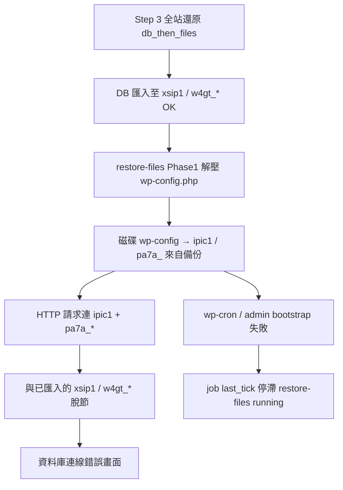

# Bug 調查報告：shineching.com Step 3 還原失敗 → 資料庫連線錯誤（2.7.274，第二次現場）

| 項目 | 內容 |
|------|------|
| **站點** | https://shineching.com/ |
| **Docroot（唯一調查範圍）** | `/home/qj8hea4vdto3/public_html/shineching.com` |
| **主機** | GoDaddy shared，`132.148.179.46`，SSH 使用者 `qj8hea4vdto3` |
| **外掛版本（SSH 已確認）** | **2.7.274**（`Version: 2.7.274` / build log `build_id: 2.7.274`） |
| **PHP / WP** | PHP 8.3.30（CLI/web）；WordPress **7.0**（validation meta） |
| **還原 Job ID** | `rjb_20260530_203331_puowui` |
| **還原來源檔** | `shineching.com-20260531013823-V6yYBa-1.zip`（564.71 MB；SHA1 `76c01c2f9f06067cd961dc4facd7812b28b45610`） |
| **還原前快照** | `shineching.com-20260530203333-uhT43A.zip`（27.14 MB，自動 pre-restore backup） |
| **使用者可見症狀** | Step 3（P3）失敗；重整 Restore 頁 → **「建立資料庫連線時發生錯誤」**（非 2.7.273 的 Parse error） |
| **嚴重度** | **P0** — 還原未完成、站點 HTTP 無法 bootstrap、job 永久 `running` |
| **調查日期** | 2026-05-31（SSH 唯讀取證） |
| **前案** | [2.7.273 shineching Parse error](BUG-INVESTIGATION-2026-05-31-shineching-p3-restore-critical-error-2.7.273.md)（同備份、同 Step 3 路徑） |

---

## 1. 問題摘要（使用者可見）

1. 使用 **2.7.274** 對 shineching.com 執行 **全站還原**（564 MB 備份 `V6yYBa-1.zip`），Step 3 進程**失敗／中斷**（第二次現場失敗）。
2. 重整 `https://shineching.com/wp-admin/admin.php?page=museder-restoreone-restore` 後，出現 WordPress **「建立資料庫連線時發生錯誤」**（截圖約 2026-05-31 16:37 UTC+8）。

**與 2.7.273 第一次失敗的差異：**

| 項目 | 2.7.273（第一次） | 2.7.274（第二次） |
|------|-------------------|-------------------|
| 使用者畫面 | 嚴重錯誤（Parse error） | **資料庫連線錯誤** |
| `class-wp-site-health.php` | **90,112 bytes（截斷）** | **131,241 bytes（完整）** |
| `*.museder-restoreone-partial` | 無（2.7.273 半寫入 live 檔） | **無**（2.7.274 原子 sidecar 未留殘） |
| job 停滯點 | `zip_index` 1080，卡在 `site-health` 半寫 | `zip_index` 655，phase1 進行中 |

**2.7.274 原子寫入修復在本案已生效**（core 檔未再半寫入），但還原仍失敗，且暴露 **wp-config 中還原策略** 的新 P0 路徑。

---

## 2. 時間線（UTC+8，來自 `backup-lite-*.log` 與 job meta）

| 時間 (UTC+8) | 事件 |
|--------------|------|
| 04:28:02 | chunk finalize 完成；prepare 偵測 `target_prefix: w4gt_` |
| 04:33:31 | Restore job prepared — `rjb_20260530_203331_puowui` |
| 04:33:33–04:33:40 | validated；pre-restore snapshot `uhT43A.zip` 完成 |
| 04:34:01 | 2.7.274 build active |
| 04:34:23 | DB 匯入完成；**Mid-restore plugin isolation** 啟用 |
| 04:34:37 | `restore-files` self-protect skipped 5 個 RestoreOne 檔 |
| 04:35:47 | self-protect skipped 累計 73 個 |
| **04:35:51** | job `last_tick` **最後更新**（UTC 20:35:51）— **之後無新 tick** |
| **~04:36:01** | `wp-config.php` mtime（磁碟覆寫時刻） |
| **~04:37** | 使用者重整 Restore 頁 → **資料庫連線錯誤** |

---

## 3. 主機證據（2.7.274，唯讀）

### 3.1 Job meta（`jobs/rjb_20260530_203331_puowui.json`）

| 欄位 | 值 | 解讀 |
|------|-----|------|
| `stage` | **`restore-files`** | 卡在檔案解壓階段 |
| `progress` | **86** | Phase1 floor ~85%（與 2.7.273 相同 UI 誤導） |
| `message` | Restoring WordPress core and site root files… | Phase 1（core / site root） |
| `completed` | `false` | 還原未結束 |
| `tick_source` | `cron` | WP-Cron 切片 |
| `last_tick` | `1780173351` | **已停滯** |
| `checkpoints.zip_files_phase` | **1** | wp-content 已完成，正在 core |
| `checkpoints.zip_index` | **655** | 全 archive 條目索引 |
| `checkpoints.zip_phase1_entry_done` | **626** / **3543** | Phase1 約 **17.7%** |
| `checkpoints.zip_entry_offset` | **0** | 當前條目內 offset（非半寫入條目） |
| `options.files_only` | `false` | 全站還原 |
| `options.restore_order` | `db_then_files` | 先 DB 後檔案 |
| `options.wp_config_mode` | **`backup`** | 從備份還原 wp-config |
| `options.db_target_prefix` | **`w4gt_`** | DB 匯入目標 prefix |
| `validation.checksum.ok` | `true` | 來源 ZIP 無問題 |

**無 `error` 欄位、日誌無 `[ERROR]`** — job 以 **`running` + 停滯 checkpoint** 掛起。

### 3.2 【決定性】wp-config 與 DB 匯入目標不一致

| 來源 | `DB_NAME` | `DB_USER` | `$table_prefix` |
|------|-----------|-----------|-----------------|
| **還原前快照** `uhT43A.zip`（現場真實設定） | `i10269493_xsip1` | `i10269493_xsip1` | **`w4gt_`** |
| **還原來源** `V6yYBa-1.zip`（備份內 wp-config） | `i10269493_ipic1` | `i10269493_ipic1` | **`pa7a_`** |
| **失敗後磁碟** `wp-config.php` | `i10269493_ipic1` | `i10269493_ipic1` | **`pa7a_`** |
| **Job options** | — | — | **`db_target_prefix: w4gt_`** |

**解讀：**

1. **DB 匯入階段**使用還原前現場 wp-config（`xsip1` / `w4gt_`），將備份資料寫入 **主機資料庫** `i10269493_xsip1` 的 **`w4gt_*` 表**。
2. **`restore-files` + `wp_config_mode: backup`** 在 Phase1 解壓時，將備份 ZIP 內 **`wp-config.php` 覆寫到 docroot**（備份內為 **`ipic1` / `pa7a_`**）。
3. 覆寫後 WordPress HTTP bootstrap 改連 **`i10269493_ipic1`** 並查找 **`pa7a_*` 表** — 與剛匯入的 **`xsip1` / `w4gt_*` 資料** 完全脫節。
4. CLI `php` 載入 `wp-load.php` 輸出 **「資料庫錯誤」** HTML（與使用者截圖一致）。

**`wp-config.php` 在 Phase1 解壓順序中極早（約第 24 個 site-root 條目）**；job 後續仍推進至 `zip_phase1_entry_done=626`，故 **檔案解壓 worker 可在 wp-config 已壞的情況下繼續一段時間**；但 **一般 HTTP / wp-admin / wp-cron 請求已無法 bootstrap**。

### 3.3 2.7.274 原子寫入（對照 2.7.273）

| 路徑 | 磁碟大小 | 備份 ZIP 內大小 | `php -l` |
|------|----------|-----------------|----------|
| `wp-admin/includes/class-wp-site-health.php` | **131,241** | **131,241** | **OK** |
| `*.museder-restoreone-partial` | **0 個** | — | — |

**結論：2.7.274 `extract_zip_filtered_sliced()` 原子 sidecar 修復在本案有效**；本次 P0 **不是** core 半寫入回歸。

### 3.4 還原附帶狀態

| 項目 | 狀態 |
|------|------|
| `restore-history.json` | `result: "running"` |
| `temp/.../run.lock` | 存在（空檔） |
| `mu-plugins/museder-restoreone-restore-isolation.php` | **仍存在**（mid-restore 未退出） |
| `error_log` | 調查時段 **無** 新 Parse error；舊 log 為 wp-statistics 警告 |

---

## 4. 根因分析（2.7.274 產品路徑）

### 4.1 【決定性 P0】`wp_config_mode=backup` 在 `db_then_files` 全站還原中，**於 restore-files 中途覆寫 wp-config**，未保留主機 DB 連線

**程式路徑（2.7.274，未改 wp-config 策略）：**

| 步驟 | 程式 | 行為 |
|------|------|------|
| DB 匯入 | `restore-extract-db` | 使用**還原前**現場 DB 連線；依 `db_target_prefix` 寫入 `w4gt_*` |
| 跳過 wp-config？ | `zip_entry_should_skip_restore()` | `wp_config_mode=backup` → **`should_skip_wp_config_in_zip()` = false** → **會解壓 wp-config.php** |
| Phase1 解壓 | `extract_zip_filtered_sliced()` | 將備份內 `wp-config.php` 寫入 docroot（2.7.274 原子寫入，但**內容仍是備份 credentials**） |
| 完成後策略 | `apply_wp_config_policy()` | `MODE_CONFIG_BACKUP` 僅 `return file_exists($dest_config)` — **不 merge 主機 DB_* / prefix** |
| Merge 模式 | `MODE_CONFIG_MERGE` | **僅在完成階段**才 merge DB_* from destination — **中途解壓已覆寫，來不及** |

**本案觸發條件（populated_wp + 跨 DB 世代備份）：**

- 現場 shineching 使用 **`xsip1` / `w4gt_`**。
- 測試備份 `V6yYBa` 內嵌 **`ipic1` / `pa7a_`**（舊環境 wp-config，與現場不一致）。
- 使用者選項 **`wp_config_mode: backup`**（與 Step 3 預設／現場操作一致）。
- 結果：**DB 寫入 A，wp-config 指向 B** → HTTP **資料庫連線錯誤**。

### 4.2 【高信心 P1】wp-config 損壞後 cron 停滯（自我強化環路，觸發點與 2.7.273 不同）

| 觀察 | 推論 |
|------|------|
| `last_tick` 停滯、`completed: false` | 還原 job 掛起 |
| wp-config 已指向無效 DB | **wp-cron / admin HTTP 無法 bootstrap** |
| mid-restore isolation 仍 active | MU guard 依 `$wpdb` 讀 option — bootstrap 失敗後 **無法正常退出** |
| 無 `*.partial`、core 完整 | 2.7.274 不再因 Parse error 卡死，改由 **DB bootstrap 失敗** 卡死 |

**與 2.7.273 環路對照：**

| | 2.7.273 | 2.7.274（本案） |
|--|---------|-----------------|
| 卡死觸發 | 半寫入 core → Parse error | **中途 wp-config 覆寫 → DB error** |
| 2.7.274 修復 | 未解決 cron 停滯根因 | 原子寫入 **已解決** core 半寫 |
| 共同點 | job `running`、isolation 未清、需人工修復 | 同左 |

### 4.3 【中信心】離線 QA 未覆蓋本案（非 regression 否認，屬 coverage gap）

`docs/QA-PRE-RELEASE-REPORT-SHINECHING-PROFILE-2.7.274.md` §5.1 已記載：Docker 全站還原後 **wp-config 被備份覆寫為 production DB 設定** → 下一 HTTP 請求 500。E2E 在 **同一 CLI 請求內** 完成斷言，**未模擬 populated host 上「備份 wp-config DB ≠ 現場 DB」** 的本案組合。

---

## 5. 是否為 2.7.274 新 regression？

### 5.1 原子解壓：**否（修復有效）**

- `class-wp-site-health.php` 完整；無 partial sidecar。
- 2.7.274 針對 2.7.273 P0 的修復 **在本案成立**。

### 5.2 wp-config / DB 一致性：**既有設計缺陷，本案為 2.7.274 發佈後現場新暴露的 P0**

| 比對 | 結果 |
|------|------|
| `wp_config_mode=backup` 在 restore-files **解壓** wp-config | 2.7.273 / 2.7.274 **相同**（`should_skip_wp_config_in_zip` 僅 skip `keep`） |
| `apply_wp_config_policy` backup 模式 | **不 merge 主機 credentials**（2.7.274 未改） |
| 2.7.273 現場 | 同備份、同 `backup` 模式；wp-config 亦為 **`pa7a_`**（見前案 §3.4） |
| 2.7.274 差異 | core 不再半寫 → job 推進更遠 → **HTTP 先以 DB error 顯性失敗**（而非 Parse error） |

**結論：** 非 2.7.274 新引入的解壓邏輯 regression，但 **2.7.274 未處理 wp-config 與 db_target_prefix 一致性**；在 shineching **populated host + 跨世代備份** 下為 **可重現 P0**，且 **離線 QA PASS 不能代表本案安全**。

---

## 6. 建議開發 Agent 調查方向（僅分析，本報告不含修復實作）

1. **`wp_config_mode=backup` + `db_then_files` + populated site`**
   - 是否應 **延後** wp-config 套用至 job 完成（與 `MODE_CONFIG_MERGE` 類似）？
   - 或 restore-files **永遠 skip** wp-config，完成時 **merge：DB_* + prefix 保留 destination，其餘來自 backup**？
   - 或 detect `archive DB_NAME/prefix ≠ live` 時 **強制 merge / 警告 / 阻擋 Step 3**？

2. **`db_target_prefix` vs wp-config `$table_prefix`**
   - DB 匯入使用 `w4gt_`，備份 wp-config 為 `pa7a_` — 是否應同步更新 wp-config prefix 或 preflight 阻擋？

3. **Mid-restore failure 復原**
   - wp-config 中途覆寫後 job 仍 `running` — watchdog 是否應偵測 **HTTP bootstrap 失敗** 並標記 failed / 自動還原 pre-restore wp-config？

4. **回歸測試**
   - 新增 QA：**populated host credentials ≠ archive wp-config**（可仿 shineching `xsip1/w4gt_` vs `ipic1/pa7a_`）。
   - 保留 2.7.274 原子寫入 L0/L1 測試。

---

## 7. 現場修復資料（供維運參考，非本輪調查執行）

| 資產 | 路徑 | 用途 |
|------|------|------|
| Pre-restore 快照 | `.../backups/shineching.com-20260530203333-uhT43A.zip` | 含正確 `xsip1` / `w4gt_` wp-config |
| 第一次 2.7.273 快照 | `.../backups/shineching.com-20260531023307-WPKJjN.zip` | 若需更早時間點 |
| 損壞 job | `rjb_20260530_203331_puowui` | 應取消／清理後再還原 |

**注意：** 本報告撰寫時 **未修改** docroot 任何檔案（唯讀 SSH）。

---

## 8. 證據索引

| 證據 | 位置 |
|------|------|
| Job meta | `wp-content/uploads/museder-restoreone/jobs/rjb_20260530_203331_puowui.json` |
| 日誌 | `.../logs/backup-lite-2026-05-30.log`、`backup-lite-2026-05-31.log` |
| History | `.../restore-history.json` → `result: running` |
| 程式 | `includes/class-restore-preflight.php`（`should_skip_wp_config_in_zip`, `apply_wp_config_policy`） |
| 程式 | `includes/class-restore-service.php`（`zip_entry_should_skip_restore`, `complete_files_stage_and_advance`） |
| 前案 | `docs/BUG-INVESTIGATION-2026-05-31-shineching-p3-restore-critical-error-2.7.273.md` |
| QA | `docs/QA-PRE-RELEASE-REPORT-SHINECHING-PROFILE-2.7.274.md` §5.1 |

---

## 9. 給開發 Agent 的一行摘要

**2.7.274 已修掉 core 半寫入，但 shineching 第二次 Step 3 仍 P0 失敗：DB 先匯入 `xsip1/w4gt_`，restore-files 又以 `wp_config_mode=backup` 把 wp-config 覆成備份內的 `ipic1/pa7a_`，導致資料庫連線錯誤與 cron 停滯；需修 wp-config 套用時機／merge 策略與 populated-host QA，而非再改 atomic sidecar。**
