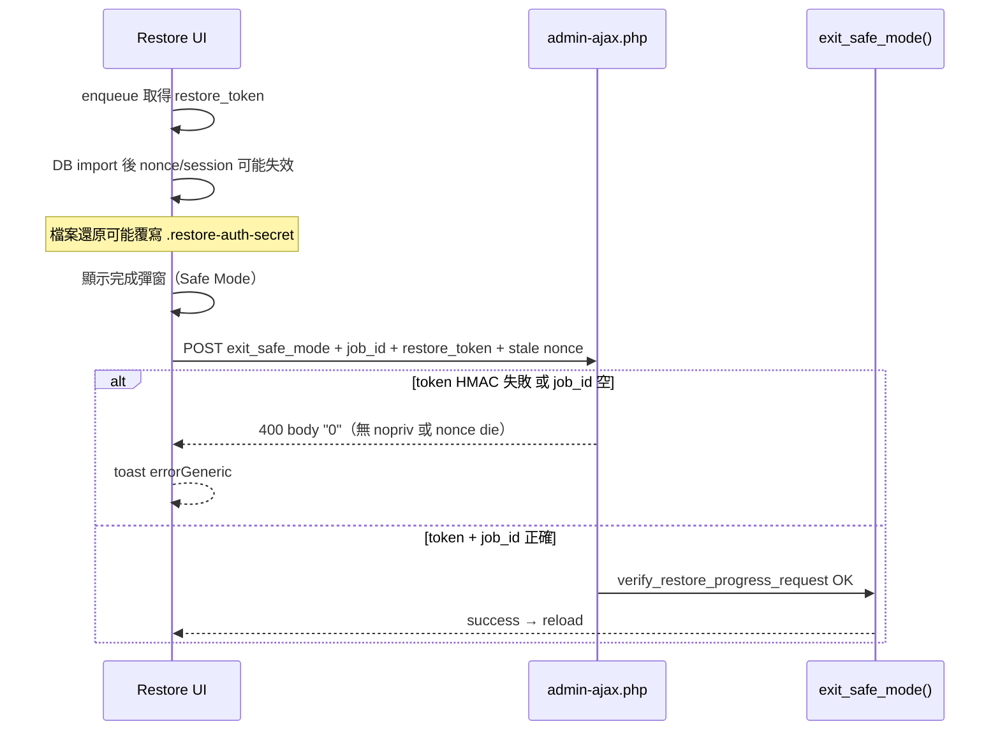

# Bug 調查報告：shineching 手動還原後 Exit Safe Mode 仍失敗（2.7.275）

## 結論（先看）

- **不是部署漏版。** 主機 `admin.js` / `class-restore-handler.php` / `class-ui.php` 與本地 SHA256 在 Round 2 已一致（2.7.275）。
- 你截圖的症狀（完成彈窗正常、點 **Exit Safe Mode** 後右上紅 toast：`An unexpected error occurred. Check logs for details.`）來自 **AJAX 授權鏈在還原後斷裂**，不是 Safe Mode 後端邏輯本身壞掉。
- 根因有 **三層疊加**（任一層失敗都會觸發相同 UI）：
  1. **post-complete token 驗證失敗**（檔案還原覆寫 `.restore-auth-secret` → HMAC 比對失敗）
  2. **`exit_safe_mode` 缺少 `wp_ajax_nopriv_*`** → session 對 AJAX 失效時 WordPress 直接回 `0`（access log 常見 `400` body size **1**）
  3. **前端 overlay 在部分時序下 `job_id` / token 未綁定**（早退分支、poll `completionMeta` 缺 `jobId`）

---

## 1) 使用者現象（2026-06-03 ~16:06 +08）

| 觀察 | 說明 |
|---|---|
| 還原進度 | 進度條 100%，完成彈窗顯示 Safe Mode 提示 |
| 操作 | 點 **Exit Safe Mode** |
| 結果 | 紅色 toast：`An unexpected error occurred. Check logs for details.` |
| 推定 job | `rjb_20260603_080340_9zdu3h`（與 log 時間吻合） |

---

## 2) 本地程式調查

### A. 前端錯誤來源

`assets/js/admin.js` overlay 的 `error` callback 在無法解析 JSON 時 fallback 到 `strings.errorGeneric`：

```3344:3350:assets/js/admin.js
                            error: function (xhr) {
                                var message = strings.errorGeneric || 'An error occurred. Please try again.';
                                if (xhr && xhr.responseJSON && xhr.responseJSON.data && xhr.responseJSON.data.message) {
                                    message = xhr.responseJSON.data.message;
                                }
                                showToast('❌ ' + message, 'error');
```

因此使用者看到的 generic 訊息，代表 **HTTP 層失敗且 response 不是 `{ success, data: { message } }` 結構**（常見 body 為字面量 `0`）。

### B. `buildSafeModeExitData` 已存在，但 overlay 綁 job 不完整

2.7.275 已引入 `buildSafeModeExitData()` / `completedRestoreToken`，**不再**於完成時清空 `activeRestoreToken`（僅成功退出 Safe Mode 後才清）。

仍存在的缺口：

- overlay callback 原先優先取 `restoreMonitor.jobId`，未優先 `completedRestoreJobId`
- poll 路徑的 `completionMeta` 缺少 `jobId`，早退分支（overlay 已顯示）不補寫 token

### C. 後端 `exit_safe_mode` 與 progress 授權不對稱

`restore_job_status` / `restore_final_status` / `restore_tick` 均有：

- `wp_ajax_*` + **`wp_ajax_nopriv_*`**
- `Museder_Restoreone_UI::verify_restore_progress_request()`（token / post-complete grant 優先）

但 **`exit_safe_mode` 在修復前只有 `wp_ajax_*`**，且 token 失敗後走 `check_ajax_referer()`（nonce 在 DB import 後常失效）。

---

## 3) 主機 / access log 證據

歷史 log（`docs/qa-evidence/shineching-field-2.7.275-rerun-20260603/investigate-host-log-latest.txt`）在還原完成窗口可見：

| HTTP | body size | 意義 |
|---|---|---|
| `403` | ~111 bytes | 插件 JSON 錯誤（如 invalid nonce） |
| `400` | **1 byte** | WordPress 典型 **`0`** 回應（handler 未命中或 die） |
| REST `final-status?_restore_token=...` | `200` | **同一 session 內 token 仍有效**，但 admin-ajax nonce 路徑失敗 |

同一頁面可同時「REST 輪詢成功 + admin-ajax 失敗」——與本次 Exit Safe Mode 症狀一致。

Round 2 CLI 驗證：`exit_safe_mode()` 本身可成功（`safe_mode_before=1 → after=`），證明 **後端清除 Safe Mode 沒壞，壞的是瀏覽器 AJAX 授權路徑**。

---

## 4) 根因鏈（高信心）



### 根因 1：post-complete HMAC secret 被檔案還原覆寫

- Token 於 job 開始時以 `.restore-auth-secret` 做 `stable_token_hash()` 寫入 grant（`revoke()` 時）
- `restore-files` 階段可能從備份解出 `uploads/museder-restoreone/temp/.restore-auth-secret`
- 完成後 `verify_post_complete_read()` 用 **當前 secret** 重算 HMAC → 與 grant 中 hash 不一致 → token 路徑失敗

### 根因 2：缺少 nopriv handler

- DB import 後 cookie/session 對 `admin-ajax.php` 可能無效
- 無 `wp_ajax_nopriv_museder_restoreone_exit_safe_mode` 時，WordPress 不回 JSON，只回 **`0`**
- 前端進 `error` callback → `errorGeneric`

### 根因 3：前端 job/token 綁定時序

- 多次 `markRestoreCompleted()` 早退（overlay 已存在）時，若首次未寫入 `completedRestoreToken`，Exit 仍會送空 token
- poll 完成態曾缺 `completionMeta.jobId`

---

## 5) 本次已實作修復（本地，待部署 shineching 驗證）

| 檔案 | 變更 |
|---|---|
| `includes/class-restore-handler.php` | 新增 `wp_ajax_nopriv_*`；`exit_safe_mode` 改用 `verify_restore_progress_request()` |
| `includes/class-restore-token.php` | 檔案還原前後 backup/restore runtime auth；ZIP entry skip helper |
| `includes/class-restore-service.php` | files stage 備份/還原 auth；ZIP 跳過 `.restore-auth-*` |
| `assets/js/admin.js` | overlay 優先 `completedRestoreJobId`；早退補 token；poll meta 加 `jobId` |

---

## 6) 建議驗證步驟（shineching-only）

1. 部署上述修補後確認 hash 與版本
2. 跑一次完整 UI 還原（Safe Mode 開啟）
3. 完成彈窗點 **Exit Safe Mode** — 預期成功 toast + reload
4. 查 access log：該 POST 應為 **`200` JSON success**，不應再出現 **`400` size 1**
5. 若仍失敗：在 DevTools Network 檢查 POST body 是否含非空 `job_id` + `restore_token`

---

## 7) 判定

| 項目 | 判定 |
|---|---|
| 主機版本不一致 | **排除** |
| Safe Mode 後端 CLI | **正常** |
| Exit Safe Mode UI AJAX | **異常（授權鏈）** |
| 修復方向 | token-first + 保留 auth secret + nopriv + 前端 job/token 綁定 |

問題本質：**還原完成後的 post-complete 操作仍部分依賴 import 前 nonce/session**，與 progress 輪詢已 token 化的設計不一致；Exit Safe Mode 是最後一個未對齊的入口。
