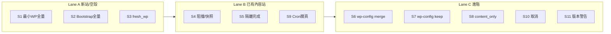

# 做法 B 通用還原驗收 — AI 測試 Agent 任務書

**用途：** 將本文件（或 §0 指令區塊）整份提交給 **測試規劃／執行 Agent**，完成 Museder RestoreOne **通用還原**驗收（非單一客戶站修復）。

**外掛 baseline：** `2.7.268`（`MUSEDER_RESTOREONE_BUILD_ID` 應含 `2.7.268`）  
**規格來源：** `docs/PLAN-RESTORE-APPROACH-B.md`  
**封裝：** `docs/PACKAGING.md`（Windows 勿用 `Compress-Archive`）  
**既有 sunpower 報告：** `docs/QA-SUNPOWEROFLIGHT-COMPLETION-REPORT-2026-05-25.md`（**勿在生產 sunpower 重跑全量還原**）

---

## 0. 提交給 Agent 的指令（可直接複製）

```text
你是 Museder RestoreOne 的測試 Agent。請依 docs/QA-APPROACH-B-AGENT-HANDOFF.md 規劃並執行「做法 B 通用還原驗收矩陣」。

目標：驗證外掛在「各種使用者網站情境」可安全還原，不是只修某一個客戶站。

硬性約束：
1. 測試必須在「獨立 docroot」進行（建議 public_html/qa-restore-test/ 或 Docker），禁止在共用 public_html 根目錄跑全站 ZIP 還原。
2. 禁止對 sunpoweroflight.com 生產 docroot 再跑一輪全量覆寫還原（除非使用者明確授權）。
3. 外掛版本須為 2.7.268+；部署 zip 須通過 docs/PACKAGING.md（ZIP 內為 museder-restoreone/museder-restoreone.php，路徑用 /）。
4. 每個情境輸出 Pass / Fail / Blocked + 證據路徑；P0/P1 立即記 BUG 並停止同 lane 後續項直到重測通過。

請先輸出：
A) 測試環境建置計畫（docroot、DB、備份 zip、網域/URL）
B) 執行順序（Lane A/B/C）
C) 逐項測試步驟與斷言（S1–S11，含 S12–S14 若時間允許）
D) 證據收集與完成報告模板

通過後再執行；每完成一項更新 docs/QA-APPROACH-B-RESULTS.md（若不存在則建立）。
```

---

## 1. Agent 角色與驗收目標

| 項目 | 說明 |
|------|------|
| **角色** | QA / 場測 Agent（可 SSH、可 WP-CLI、可 curl；憑證由維運提供，**勿寫入 repo**） |
| **驗收對象** | WordPress.org Lite 外掛 **Museder RestoreOne** 的 **做法 B 全站還原** |
| **成功定義** | §6 必跑情境 **Pass** 或 **Blocked（有書面原因）**；P0/P1 bug 皆 **Fixed + Verify** 或 Won't fix 有理由 |
| **非目標** | 不修客戶站內容、不動其它 addon 正式站、不做 WordPress.org SVN 發佈（除非另授權） |

---

## 2. 測試環境（必須先建）

### 2.1 推薦：獨立 QA docroot（cPanel addon 或子目錄）

```text
DocumentRoot:  {account}/public_html/qa-restore-test/
URL:           https://{addon-domain}/  或暫不綁域用子路徑（需可 HTTP + wp-cron loopback）
外掛:          .../qa-restore-test/wp-content/plugins/museder-restoreone/
備份庫:        .../qa-restore-test/wp-content/uploads/museder-restoreone/backups/
```

**建立步驟（Agent 可寫成 script）：**

1. 建立空目錄 `qa-restore-test/`（或 wipe 後重用）。
2. 建立 **獨立 MySQL 資料庫**（勿與生產 sunpower DB 共用）。
3. 部署外掛 **2.7.268**（`bash create-package.sh` 或 `tools/package-lite-windows.ps1` → unzip 到 `plugins/museder-restoreone/`）。
4. 準備 **至少 2 個測試封存**：
   - **FULL**：含 `wp-admin`、`wp-includes`、根目錄核心、wp-content（建議用小型測試站備份，或 repo 內可公開的 sample；勿提交客戶機密至 Git）。
   - **CONTENT_ONLY**（選用 S8）：僅 wp-content、**無**核心。
5. 確認 `wp-content/uploads/museder-restoreone/` 可寫；短期開 `WP_DEBUG_LOG`（不對外顯示）。

### 2.2 替代：Docker 本機

```bash
docker compose up -d
bash tools/docker/setup.sh
```

於容器內 docroot 跑同一矩陣；證據路徑改為容器內路徑。

### 2.3 禁止使用的環境

| 禁止 | 原因 |
|------|------|
| `public_html/` **帳號根** 全站還原 | 與多 addon 共用；會影響所有站（P0 架構風險） |
| `sunpoweroflight.com` **生產 docroot** 全量覆寫還原 | 已有成功 job；重跑會長時間鎖站且無隔離 A/B |
| 其它 addon 正式站（centraltaipei、ciouyinghao…） | 非測試環境 |

---

## 3. 執行前檢查（每個 Lane 開始前）

| # | 檢查 | 通過條件 |
|---|------|----------|
| T0 | 外掛版本 | `Version` 與 `MUSEDER_RESTOREONE_BUILD_ID` ≥ `2.7.268` |
| T1 | docroot 隔離 | 僅操作 `qa-restore-test/`（或 Docker 站） |
| T2 | 可寫目錄 | `uploads/museder-restoreone/{backups,jobs,logs}` 可寫 |
| T3 | Cron | `DISABLE_WP_CRON` 未設為 true；loopback 可達 `wp-cron.php` |
| T4 | 封存 | 測試 zip 在 backups 目錄且 preflight 可讀 |
| T5 | 證據目錄 | 建立 `docs/QA-APPROACH-B-RESULTS.md` 結果表 |

---

## 4. 執行順序（Lane）



| Lane | 情境 ID | 說明 |
|------|---------|------|
| **A** | S1, S2, S3 | 新站／空殼／bootstrap |
| **B** | S4, S5, S9 | populated_wp + Cron |
| **C** | S6, S7, S8, S10, S11 | wp-config、scope、取消、警告 |
| **選跑** | S12, S13, S14 | 進階順序、關隔離、Multisite |

**規則：** Lane 內遇 **P0/P1 Fail** → 記 BUG → 修復或 Blocked → **重跑該項** 後才繼續同 Lane。

---

## 5. 測試案例清單（Agent 逐項執行）

狀態欄請填：`Pass` | `Fail` | `Blocked` | `Skip（原因）`

### 5.1 必跑（S1–S11）

---

#### S1 — 最小 WP / empty_shell 全量還原（先檔後 DB）

| 欄位 | 內容 |
|------|------|
| **Profile** | `empty_shell` 或最小 WP（可只有 plugins 目錄 + 外掛） |
| **前置** | docroot **不要**手動放 `.htaccess`；準備 **FULL** zip |
| **Step 2** | scope=全站；wp-config=**覆蓋（backup）**；順序=**files_then_db** |
| **步驟** | 1) preflight 通過 2) 啟動還原 3) 等 job 完成（Cron loopback） |
| **斷言** | `wp-admin/`、`wp-includes/`、`index.php` 存在；`restore-history.json` result=success；前台 HTTP 200 |
| **子項 S1-htaccess** | docroot 有 `.htaccess` **或** 主機為 Nginx 且 readme 已說明（Fail 記 P2 BUG-SUN-002 類） |
| **證據** | job_id、log 尾端、ls docroot、curl -sI / |
| **已知** | sunpower 5/24 job 可作 **Pass（證據型）** 參考，**本項仍須在 QA docroot 重跑或 Blocked 註明沿用證據** |

---

#### S2 — Bootstrap 空 docroot **全量 E2E**（非只開頁面）

| 欄位 | 內容 |
|------|------|
| **Profile** | empty_shell（**無** wp-admin） |
| **前置** | 僅保留可寫 docroot + `wp-content/uploads/museder-restoreone/backups/*.zip`；複製 `museder-restoreone-restore-bootstrap.php` 到 docroot |
| **Step 2** | 經 bootstrap 表單 POST 啟動；secret ≥8 字；files_then_db |
| **步驟** | 1) curl bootstrap → 200 2) POST 啟動 job 3) 無 WP 時由 bootstrap 切片 4) 出現 `wp-load.php` 後 Cron 收尾 |
| **斷言** | job 100%；核心檔出現；**不可**只驗證表單 HTML |
| **證據** | bootstrap URL、handoff JSON、job meta stage 變化 |
| **已知** | 267/268 僅驗證 UI 200；**本項為未完成的關鍵缺口** |

---

#### S3 — fresh_wp（新裝 WP，先檔後 DB，DB 覆寫）

| 欄位 | 內容 |
|------|------|
| **Profile** | `fresh_wp` |
| **前置** | 完成 WP 安裝（hello world）；幾乎無自訂內容 |
| **Step 2** | UI 須有 **DB 覆寫警告**；預設 **files_then_db** |
| **斷言** | 還原後可登入（**備份**帳密）；安裝建立的假資料被備份 DB 取代（預期） |
| **證據** | Step 2 截圖或 HTML 片段、還原後 user 表或登入結果 |

---

#### S4 — populated_wp 阻擋與強制快照

| 欄位 | 內容 |
|------|------|
| **Profile** | `populated_wp` |
| **前置** | 站內已有文章或 uploads 檔案 |
| **Step 2** | **還原前快照** 勾選且 **disabled**；**未勾 overwrite** |
| **斷言** | preflight **阻擋** 開始（文案正確） |
| **子項 S4b** | 勾 overwrite + 快照 → **允許** 且能跑完 |
| **證據** | preflight JSON/錯誤訊息、S4b job success |

---

#### S5 — populated_wp 外掛隔離與順序

| 欄位 | 內容 |
|------|------|
| **前置** | 同 S4b（overwrite ON） |
| **Step 2** | **pause other plugins ON**；順序 **db_then_files**（預設） |
| **斷言** | 還原中 MU/`active_plugins` 隔離生效；完成後 safe plugins reapply；`restore_order` 寫入 job meta |
| **證據** | job options、MU plugin 檔存在時段、完成後 plugin list |

---

#### S6 — wp-config **合併（merge）**

| 欄位 | 內容 |
|------|------|
| **前置** | 目的地 `wp-config.php` 含**正確** `DB_*`（指向 QA DB）；備份 wp-config 含不同 `AUTH_KEY` 等 |
| **Step 2** | wp_config_mode = **merge** |
| **斷言** | 還原後 **DB_* 仍為目的地**；其餘常數來自備份；站可連線 |
| **證據** | 還原前後 wp-config diff（遮罩密碼） |

---

#### S7 — wp-config **保留（keep）**

| 欄位 | 內容 |
|------|------|
| **Step 2** | wp_config_mode = **keep** |
| **斷言** | 目的地 `wp-config.php` **未整檔覆蓋**（mtime 或內容比對） |
| **證據** | 還原前後 hash/mtime |

---

#### S8 — 僅 wp-content 封存（scope 驗證）

| 欄位 | 內容 |
|------|------|
| **封存** | **CONTENT_ONLY** zip（無核心） |
| **8a** | 目的地 **已有核心** → content_only **可成功** |
| **8b** | 目的地 **empty_shell 無核心** → preflight **阻擋** |
| **證據** | 兩次 preflight 結果對照 |

---

#### S9 — Cron 主導（關閉還原頁仍完成）

| 欄位 | 內容 |
|------|------|
| **前置** | 任一大檔 FULL 還原 |
| **步驟** | 啟動還原後 **關閉瀏覽器/還原頁**；僅依 Cron loopback（必要時 nudge `wp cron event run`） |
| **斷言** | 15–30 分鐘內 progress 持續至 100%；`restore-history` success |
| **證據** | job meta 時間序列、log |
| **已知** | sunpower 272s job 可作參考；**QA docroot 仍建議重跑** |

---

#### S10 — 還原中途取消

| 欄位 | 內容 |
|------|------|
| **步驟** | 還原進行中（如 40–60%）按 **取消** |
| **斷言** | stage=cancelled；MU 隔離 **exit**；可再開新 job |
| **證據** | job 終態 JSON、隔離 option 清空 |

---

#### S11 — WP 版本差異警告

| 欄位 | 內容 |
|------|------|
| **前置** | 備份 WP 版本與現站差異大（可不同 minor） |
| **Step 2** | 全站 + overwrite |
| **斷言** | preflight **警告**但 **允許繼續**；核心仍解壓 |
| **證據** | preflight 警告文案、還原成功 |

---

### 5.2 選跑（S12–S14）

| ID | 測試要點 | Pass 條件 |
|----|----------|-----------|
| **S12** | populated 站 Step 2 選 **files_then_db** | job 完成；順序寫入 meta |
| **S13** | **關閉** pause other plugins | 能跑完（文件註明風險）；記錄是否 Fatal |
| **S14** | Multisite 或子路徑安裝 | 依實際環境 Blocked 或 Pass |

---

## 6. 模擬 vs 必須實跑

| 類型 | 可模擬／單元 | 必須實跑 E2E |
|------|--------------|--------------|
| preflight 文案、profile 判定 | wp eval / REST | S4 阻擋、S8 阻擋 |
| bootstrap stub 載入 | curl 200 | **S2 全量 POST** |
| zip 含 core 判定 | php unit | S1 解壓結果 |
| Cron 推進 | 部分 mock | **S9 關頁完成** |
| wp-config merge/keep | 讀檔比對 | **S6/S7 還原後連線** |

---

## 7. 證據與 Bug 規範

### 7.1 每項必交證據包

```text
Scenario ID:
Build ID:
Docroot 絕對路徑:
Backup 檔名:
Job ID:
結果: Pass | Fail | Blocked
HTTP: curl -sI {home} {wp-admin}
核心檔: test -f wp-admin/index.php && test -f wp-load.php
日誌: uploads/museder-restoreone/logs/backup-lite-YYYY-MM-DD.log（尾 50 行）
Job: uploads/museder-restoreone/jobs/{job_id}/
History: restore-history.json（最後一筆）
備註:
```

### 7.2 Bug 嚴重度與流程

| 級別 | 定義 | Agent 動作 |
|------|------|------------|
| **P0** | 多站受影響、資料遺失、無法開始還原 | 停 Lane；記 `docs/BUG-LOG-APPROACH-B-YYYY-MM.md` |
| **P1** | 卡住、Cron 不動、缺核心/DB | 停 Lane；修復後重跑 S1/S2/S9 |
| **P2** | htaccess、文案、非阻斷 | 記錄；Lane 完成後批次修 |
| **P3** | UX 次要 | 記錄；排下一版 |

### 7.3 產出檔案（Agent 交付物）

| 檔案 | 內容 |
|------|------|
| `docs/QA-APPROACH-B-RESULTS.md` | 矩陣 Pass/Fail 表 + 證據連結 |
| `docs/BUG-LOG-APPROACH-B-YYYY-MM.md` | 新 bug 清單 |
| `docs/QA-APPROACH-B-COMPLETION-REPORT.md` | 執行摘要、未測項、建議發版 |

---

## 8. 結果表模板（Agent 填寫）

複製至 `docs/QA-APPROACH-B-RESULTS.md`：

| ID | 結果 | Build | Job ID | 證據 | Bug ID | 備註 |
|----|------|-------|--------|------|--------|------|
| S1 | | | | | | |
| S1-htaccess | | | | | | |
| S2 | | | | | | |
| S3 | | | | | | |
| S4 | | | | | | |
| S4b | | | | | | |
| S5 | | | | | | |
| S6 | | | | | | |
| S7 | | | | | | |
| S8a | | | | | | |
| S8b | | | | | | |
| S9 | | | | | | |
| S10 | | | | | | |
| S11 | | | | | | |
| S12 | | | | | | |
| S13 | | | | | | |
| S14 | | | | | | |

---

## 9. 與 sunpower 專案的關係（避免重複勞動）

| 項目 | sunpower 已做 | 本矩陣仍須做 |
|------|---------------|--------------|
| populated 全量還原成功 | 5/24 job 證據 | QA docroot **S4/S5/S9** |
| bootstrap HTTP 200 | 已驗 | **S2 全量 POST** |
| preflight S4/S4b | 已驗 | QA docroot 重驗或 Blocked+引用 |
| P1 bug | 2.7.268 已修 | 回歸 S2/S4 |
| 生產站再還原 | **不做** | — |

---

## 10. 參考文件

- `docs/PLAN-RESTORE-APPROACH-B.md` — 產品規格
- `docs/PACKAGING.md` — Lite zip 規則
- `docs/RELEASE_CHECKLIST.md` — 發佈前檢查
- `docs/BUG-LOG-SUNPOWER-2026-05.md` — 已修 P1 參考
- `tools/qa/sunpower-field-qa.php` — 可改 docroot 參數做自動化輔助（非取代 E2E）

---

## 11. 階段完成定義（給專案負責人）

當以下成立，可稱 **「做法 B 通用驗收階段完成」**：

- [ ] S1–S11 皆 **Pass** 或 **Blocked（有原因）**
- [ ] **S2 全量 E2E** 在 QA docroot **Pass**（不可僅 UI）
- [ ] P0/P1 bug 清零或 Won't fix
- [ ] 完成報告已寫入 `docs/QA-APPROACH-B-COMPLETION-REPORT.md`
- [ ] 未在生產 sunpower / 共用 public_html 根造成事故
