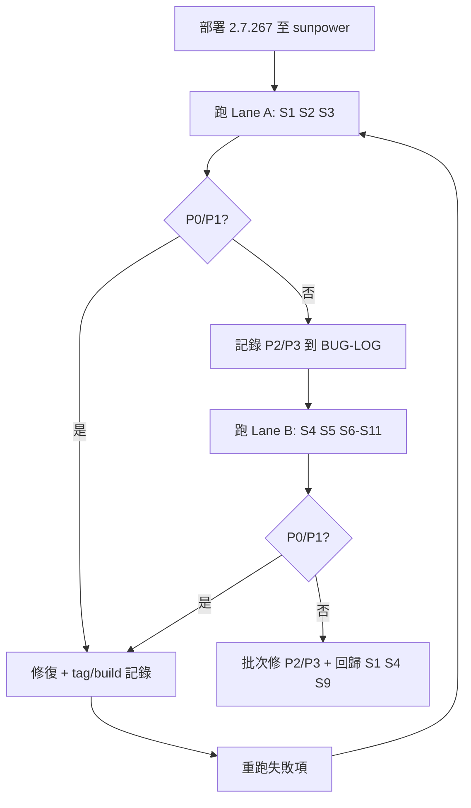

# sunpoweroflight.com 實機驗證計畫（2.7.267 / Approach B）

**狀態：** 已完成（見 `docs/QA-SUNPOWEROFLIGHT-COMPLETION-REPORT-2026-05-25.md`）  
**外掛版本：** `2.7.267`（`v2.7.267` tag）  
**主要網域：** https://sunpoweroflight.com/  
**主機別名／暫存：** `tno.5f9.mytemp.website`（Primary domain，與 sunpoweroflight 同一 docroot 時需先確認）  
**連線：** SSH `118.139.182.16:22`（cPanel：`eo8lmixijvfj` — 憑證由維運保管，**勿寫入本 repo**）

> **安全：** 曾在聊天中暴露的 cPanel／SSH 密碼請儘快輪換。本文件與 bug 紀錄一律使用「憑證在密碼庫」描述，不貼明文密碼。

---

## 1. 驗證目標

1. 確認 **做法 B**（profile、順序、wp-config 三模式、強制快照、bootstrap）在 sunpower 真實主機可行。
2. 重現並關閉歷史缺口：**全站 ZIP 只還原 wp-content**、缺核心／`.htaccess`、還原卡在 ~76%、Cron 不推進。
3. 驗收標準以 **WP-Cron loopback 為主**（還原頁可關閉；見 `docs/PLAN-RESTORE-APPROACH-B.md`）。

---

## 2. 執行前檢查（每次測試跑之前）

| 項目 | 作法 |
|------|------|
| 外掛版本 | wp-admin → 外掛列表，或 `wp-content/plugins/museder-restoreone/museder-restoreone.php` 內 `Version` / `MUSEDER_RESTOREONE_BUILD_ID` = `2.7.267` |
| DocumentRoot | SSH：`pwd` 在帳號 home；確認 `public_html` 或 addon domain 對應 **sunpoweroflight** 與 **tno.5f9.mytemp.website** 是否同一目錄 |
| 可寫權限 | `wp-content/uploads/museder-restoreone/`、`backups/`、`jobs/` 可寫 |
| 封存 | 優先：`sunpoweroflight.com-20260311014315-ptq9eY.zip`（repo `logs/150525-debug/` 僅供參考檔名；上傳以主機備份庫為準） |
| 除錯 | 建議短期開啟 `WP_DEBUG_LOG`（不對外顯示）；保留 `wp-content/debug.log` |
| 還原前快照 | **已有內容站**必測「強制還原前備份」；測試用可另開子目錄或 staging 子網域，避免覆蓋唯一生產資料 |

---

## 3. 情境矩陣（必跑）

每列跑完填 **Pass / Fail / Blocked** 與 **Bug ID**（見 §5）。

| ID | Profile | 前置 | Step 2 重點 | 還原順序 | 預期結果 |
|----|---------|------|-------------|----------|----------|
| S1 | `empty_shell` 或最小 WP | 新裝 WP 或僅 plugins 目錄；**不手動**補 `.htaccess` | 全站 scope；wp-config **覆蓋**（預設） | **先檔案後 DB** | 日誌 phase 0→1；`wp-admin/`、`wp-includes/`、根目錄 `index.php`；`.htaccess` 存在或 fallback；前台 HTTP 200 |
| S2 | 同上 + **bootstrap** | 複製 `museder-restoreone-restore-bootstrap.php` 至 docroot；ZIP 在 `uploads/.../backups/` | bootstrap 頁啟動；secret ≥8 字 | 先檔案後 DB | 無 wp-admin 時 bootstrap 切片推進；出現 `wp-load.php` 後改 Cron 完成 DB／收尾 |
| S3 | `fresh_wp` | 剛完成 WP 安裝、幾乎無內容 | UI 提示 DB 覆寫；順序預設 **先檔案後 DB** | files→db | 安裝建立的 DB 被備份 DB 取代（預期行為）；站台可登入（備份帳密） |
| S4 | `populated_wp` | 已有文章或上傳 | **還原前快照** 勾選且 disabled；未勾 overwrite → **阻擋** | db→files（預設） | 未快照／未 overwrite 不得開始；勾選 overwrite + 快照後可跑完 |
| S5 | `populated_wp` | 同 S4，允許覆寫 | overwrite ON；暫停其它外掛 ON | db→files | MU 隔離生效；完成後 safe plugins／還原外掛清單 |
| S6 | wp-config **合併** | 目的地已有正確 `DB_*` | merge 模式 | 依 S1 或 S4 | 還原後 DB 連線仍用目的地；其餘常數來自備份 |
| S7 | wp-config **保留** | 同 S6 | keep 模式 | 依 profile | 目的地 `wp-config.php` mtime／內容未整檔覆蓋 |
| S8 | 僅 wp-content 封存 | 使用**無**核心的舊包（若仍有） | scope = content_only | — | 在**已有核心**的站點可成功；在 empty_shell **阻擋** |
| S9 | Cron 主導 | 任一大檔還原 | 啟動還原後**關閉**還原頁 | — | 15–30 分鐘內 job meta `progress` 持續前進至完成；必要時僅 nudge cron |
| S10 | 取消 | 還原進行中 | 取消 | — | stage `cancelled`；隔離 exit；可再開新 job |
| S11 | 版本警告 | 備份 WP 版與現站差異大 | 全站 + overwrite | — | **警告**但可繼續；核心仍解壓 |

### 選跑（時間允許）

| ID | 說明 |
|----|------|
| S12 | `files_then_db` 在 populated 站（進階順序） |
| S13 | 暫停其它外掛 **關閉**（進階，文件註明風險） |
| S14 | Multisite／子路徑（若 sunpower 實際為子目錄安裝） |

---

## 4. 證據收集（每個 Fail 必填）

```text
主機路徑（docroot）：
外掛 BUILD_ID：
Job ID：
封存檔名：
Scenario ID：（如 S1）
```

| 類型 | 路徑／指令 |
|------|------------|
| 外掛日誌 | `wp-content/uploads/museder-restoreone/logs/backup-lite-YYYY-MM-DD.log` |
| Job meta | `wp-content/uploads/museder-restoreone/jobs/{job_id}/*.json` |
| 還原歷史 | `restore-history.json`（同 uploads 根下） |
| Bootstrap | `bootstrap-handoff.json`、`bootstrap-active-job.txt`（若有） |
| PHP error | `error_log`、`wp-content/debug.log` |
| HTTP | `curl -sI https://sunpoweroflight.com/` 與 `/wp-admin/` |
| WP-CLI（若有） | `wp cron event list`、`wp plugin list` |

---

## 5. Bug 紀錄與除錯模式（建議）

### 建議：**混合模式**（非純「全記完再修」或純「見一修一」）

| 嚴重度 | 定義 | 流程 |
|--------|------|------|
| **P0** | 站台無法存取、還原無法開始、資料遺失風險 | **立即修** → 只重跑失敗情境 → 再繼續矩陣 |
| **P1** | 還原卡住、Cron 不推進、缺核心／DB 未匯入 | **立即修**（或當日 hotfix 分支）→ 重跑 **S1/S2/S9** |
| **P2** | 進度顯示錯、文案、非阻斷警告 | **記錄** → 完成同 profile **一整條 lane** 後 **批次修** |
| **P3** | 排版、次要 UX | 記錄 → 排進下一版 |

**為何不用「全部測完再一次修」：** 還原 bug 常互相掩蓋（例如 Cron 未跑會像「檔案階段完成但 DB 永遠不動」）；全跑完再修容易一次改太多、無法對應單一情境。

**為何不用「見一個修一個」無紀律：** 容易在 S4 一半改程式、S5 用舊 build，矩陣無法比較。

### 操作節奏（建議一個工作日）



### 統一紀錄檔

- 主檔：`docs/BUG-LOG-SUNPOWER-2026-05.md`（執行時建立；一列一 bug，含 Scenario ID、證據連結、狀態 Open/Fixed/Verify）
- 大調查：`docs/BUG-INVESTIGATION-YYYY-MM-DD-<slug>.md`（單一 P0/P1 根因分析，修完可連回 BUG-LOG）

**單一 bug 模板：**

```markdown
### BUG-SUN-001 — 簡短標題
- **Scenario:** S1
- **Severity:** P1
- **Build:** 2.7.267
- **Repro:** 步驟 1…n
- **Expected / Actual:**
- **Evidence:** job_id, log 行號, curl 輸出
- **Hypothesis:**
- **Fix PR / commit:**
- **Verify:** S1 Pass @ build xxx
```

---

## 6. SSH／主機操作備忘（無密碼）

```bash
# 登入後（憑證由維運提供）
ssh -p 22 <cpanel-user>@118.139.182.16

# 找 docroot（依主機調整）
cd ~/public_html   # 或 ~/domains/sunpoweroflight.com/public_html

# 確認外掛版本
grep -E "Version:|BUILD_ID" wp-content/plugins/museder-restoreone/museder-restoreone.php

# 即時日誌
tail -f wp-content/uploads/museder-restoreone/logs/backup-lite-$(date +%F).log
```

**網域對照：** 若 `tno.5f9.mytemp.website` 與 `sunpoweroflight.com` 指向不同目錄，S1/S2 必須在**實際還原目標 docroot** 各跑一輪或在計畫中標註 Blocked。

---

## 7. 完成定義（Sign-off）

- [ ] S1–S11 至少各 1 次 Pass（或 Documented Blocked + 原因）
- [ ] S9 Cron 關頁仍完成（做法 B 核心驗收）
- [ ] sunpower 前台 + `wp-admin` 可達；permalink 正常（`.htaccess` 或伺服器規則）
- [ ] BUG-LOG 內 P0/P1 皆 **Fixed + Verify** 或明確 Won't fix
- [ ] 無未記錄的「口頭 bug」

---

## 8. 相關文件

- `docs/PLAN-RESTORE-APPROACH-B.md`
- `docs/PLAN-FULL-SITE-RESTORE.md` — 案例 A（sunpower）
- `AGENTS.md` — 還原驗收 B
- `docs/RELEASE_CHECKLIST.md`
