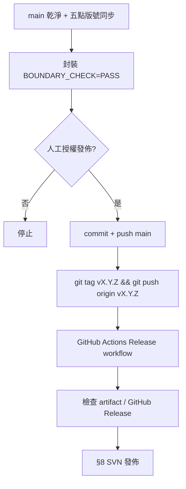

# Museder RestoreOne — 外掛修改與發佈 SOP

**適用對象：** 本機開發者、PR 審查者、Cursor / Cloud Agent  
**權威順序：** 本 SOP → `docs/WORDPRESS_ORG_DEVELOPMENT_GUIDE.md` → `.cursor/skills/museder-wporg-compliance/`  
**GitHub** = 開發可信來源；**WordPress.org SVN** = Lite 正式發佈通道（不上傳 zip）

---

## 0. 何時必須完整走本 SOP

| 變更類型 | 必走章節 |
|----------|----------|
| 修 bug / 新功能 / 改還原備份行為 | §1 → §2 → §3 → §4；若發佈再加 §5–§7 |
| 僅 `docs/`、`tools/` 內部文件 | §1 分支規範；**不** bump 版號、**不** SVN |
| readme-only（WP.org 文案修正） | §5.2 readme 五點；可 SVN readme-only commit |
| 正式發佈給使用者 | **§1–§7 全部** |

---

## 1. 開始修改前（每次）

### 1.1 同步與分支

```powershell
git fetch origin
git switch main
git pull --ff-only
git switch -c fix/<topic>    # 或 feature/、agent/、release/
```

- **禁止** 在髒的 `main` 上直接開發（除非使用者明確要求 hotfix）。
- Cloud Agent **預設不得** push `main`；需 branch 或 PR + 人工授權。

### 1.2 必讀（依任務）

| 任務 | 必讀 |
|------|------|
| 任何 PHP/JS/readme 修改 | `.cursor/skills/museder-wporg-compliance/SKILL.md` |
| 安全 / REST / AJAX | `REFERENCE.md` 對應章節 |
| 發佈 | 本 SOP §5–§7、`docs/RELEASE_CHECKLIST.md`、`docs/PACKAGING.md` |

### 1.3 Lite / Add-on 邊界（不可違反）

- **Lite（WP.org）** 必須完整可用、GPL、**無** license gate、trialware、quota/time lock、本地鎖 PRO 功能。
- **Lite zip / SVN** 不得含 `museder-restoreone-pro/`、`docs/`、`tools/`、`.cursor/`、`.github/`、`AGENTS.md`、`logs/`、`dist/`。
- 新識別字：`museder_restoreone_`、`MUSEDER_RESTOREONE_`、`Museder_Restoreone_`、`museder-restoreone/v*`、`MusederRestoreOne*`；Add-on 須有 `pro`/`addon` 區分。

---

## 2. 開發中（程式與 readme）

### 2.1 程式規範摘要

| 項目 | 要求 |
|------|------|
| 權限 | AJAX：`current_user_can()` + `check_ajax_referer()`；REST：`permission_callback` |
| 輸入 | sanitize early → validate → escape late |
| 路徑 | WordPress API + `museder_restoreone_*` helper；可寫入僅 `wp_upload_dir()/museder-restoreone/` |
| HTTP | `wp_remote_*`；第三方服務須 readme 揭露 |
| 資源 | `wp_enqueue_*`；模板禁 raw `<script>`/`<style>` |
| SQL | `$wpdb->prepare()` 或最小 PHPCS 註解 + 理由 |
| 命名 | 禁新增 `backup_lite_*`（除文件化 legacy migration） |

### 2.2 修改範圍原則

- **最小 diff**：只改任務必要檔案。
- 觸及 `museder-restoreone.php` 主檔時：檢查 `Author:` 是否仍為約定值（見 `.cursor/rules/plugin-author-display-name.mdc`）。
- **不提交**：`dist/*.zip`、`logs/`、secrets、本地備份 zip、AI 審查信。

### 2.3 開發中 readme（非發佈版）

- 功能/修復若影響使用者，**發佈前**須同步 changelog（§5.2）。
- 開發分支可暫不改版號；**禁止** 在 `main` 留 `Stable tag` 高於已發佈 SVN 卻未完成的半成品（除非 `release/<version>` 分支）。

---

## 3. 完成修改 — 驗證（發佈前必做）

### 3.1 靜態檢查

```powershell
php -l includes/class-*.php   # 所有改過的 PHP
php tools/qa/verify-*.php     # 若有對應 QA 腳本
```

### 3.2 Plugin Check 與 Smoke

- 目標：**0 errors**；warnings 須逐項確認或最小註解。
- 乾淨 WP 安裝 + `WP_DEBUG true`：啟用外掛無 fatal。
- 手動或腳本 smoke：**Dashboard、Backups、Restore、Schedules、Logs、Settings**。
- 還原/備份相關修復：優先跑 `tools/qa/` 矩陣或容器 E2E（見 `docs/QA-APPROACH-B-ENVIRONMENTS.md`）。

### 3.3 PR / 合併前自檢

- [ ] diff 無 dev-only 檔案誤加入 Lite 路徑  
- [ ] 無 secrets / 大型二進位  
- [ ] 合規 skill 項目已對照  
- [ ] 測試結果與**未測項目**已記錄（issue 或 QA 報告）

---

## 4. 版本號策略

- **格式：** `2.7.xxx`（與現有 semver 習慣一致）。
- **何時 bump：** 任何會進 WP.org Lite 的程式或 readme 使用者可見變更。
- **何時不 bump：** 僅 `docs/`（非 readme）、`.cursor/`、CI 不影響執行檔時。
- **Git tag：** `v2.7.xxx`（與 `Version` 一致，前綴 `v`）。

---

## 5. 發佈準備 — 版本與 readme 五點同步

**每次正式發佈前，以下五處必須同版號、同一次 commit：**

| # | 檔案 | 欄位 |
|---|------|------|
| 1 | `museder-restoreone.php` | `Version:` |
| 2 | `museder-restoreone.php` | `MUSEDER_RESTOREONE_VERSION` |
| 3 | `museder-restoreone.php` | `MUSEDER_RESTOREONE_BUILD_ID` |
| 4 | `readme.txt` | `Stable tag:` |
| 5 | `readme.txt` | `== Changelog ==` → `= X.Y.Z =` 新區塊（置頂） |
| 6 | `readme.txt` | `== Upgrade Notice ==` → `= X.Y.Z =` 新區塊（置頂） |

> **常見遺漏：** 只改 `Stable tag` + Changelog，**未加 Upgrade Notice** → WP.org 後台「升級說明」仍顯示舊版。

### 5.1 Changelog / Upgrade Notice 撰寫

- **Changelog：** 技術向、條列修復/功能；可含檔名/行為關鍵字。
- **Upgrade Notice：** 1–3 句、**使用者語言**；誰該升級、解決什麼痛點。
- 僅保留**一個**清楚的 `== Changelog ==` 區塊（舊版可寫「見 repo」）。

### 5.2 主檔 Author 提醒

若本次修改 `museder-restoreone.php` 且 `Author:` 仍為 `Jerry Lin`，須提醒改為 `Author: Adrian Lin`（`Author URI` 維持 artherslin；readme `Contributors: artherslin` 不變）。

### 5.3 發佈證據文件（建議）

從模板建立：`docs/RELEASE-<version>-SVN-HANDOFF.md`（見 `docs/templates/RELEASE-SVN-HANDOFF-TEMPLATE.md`）。

---

## 6. 封裝（Lite ZIP）

**必用官方腳本，禁止 `Compress-Archive`：**

```powershell
powershell -NoProfile -File tools/package-lite-windows.ps1
# 或 Linux/macOS: bash create-package.sh
```

### 6.1 通過標準

- 輸出含 **`BOUNDARY_CHECK=PASS`**
- ZIP 內為 **`museder-restoreone/museder-restoreone.php`**（正斜線 `/`）
- 本機路徑：`dist/museder-restoreone-<version>.zip`（**不提交 Git**）

### 6.2 Lite 允許 / 禁止清單

**允許：** `assets/`、`includes/`、`templates/`、`languages/`、`museder-restoreone.php`、`readme.txt`、`uninstall.php`、`download-handler.php`

**禁止：** 見 §1.3 與 `docs/PACKAGING.md`

---

## 7. GitHub 發佈流程



### 7.1 Commit 訊息

- 一行摘要 + 可選正文；說明 **why**（修復現象 / 根因）。
- **禁止** `--no-verify`（除非使用者明確要求）。

### 7.2 Tag 與 CI

- 僅在 **明確授權** 後 push `v*` tag。
- 確認 `.github/workflows/release.yml` 成功、artifact 含 Lite zip。
- **Test package：** Actions `Run workflow` 可試包，**不**建 Release、**不** SVN。

---

## 8. WordPress.org SVN 發佈

### 8.1 前置

- GitHub `main`、tag、readme 五點已一致。
- 已有 `docs/RELEASE-<version>-SVN-HANDOFF.md`。

### 8.2 步驟

```bash
svn co https://plugins.svn.wordpress.org/museder-restoreone museder-restoreone-svn
# 將 Lite 執行檔複製至 trunk/（同 PACKAGING 允許清單）
svn cp trunk tags/<version>
svn commit -m "Release <version>"
```

### 8.3 SVN 紀律

- **不上傳** zip、`.git`、`docs/`、`tools/`、`.cursor/`、`.github/`。
- `trunk/` = 可立即使用的 Lite 原始碼。
- `tags/<version>/` 自 trunk 複製；`readme.txt` `Stable tag` 指向該版。
- readme-only 修正：可只 commit `trunk/readme.txt` + `tags/<version>/readme.txt`。

### 8.4 發佈後確認

- [ ] wordpress.org 外掛頁版本與 changelog 正確  
- [ ] Upgrade Notice 顯示新版本  
- [ ] 測試站可更新至新版本  

---

## 9. 發佈後

- 監控 issue / 支援管道；重大 bug 開 `fix/` branch。
- stuck restore / 站點損壞：先調查報告 `docs/BUG-INVESTIGATION-*.md`，再修 code。
- 若 SOP 本身需修正，更新本檔 + `.cursor/rules/plugin-development-release-sop.mdc`。

---

## 10. Cursor / Cloud Agent 義務

Agent **必須**：

1. 修改前讀 `museder-wporg-compliance` skill。  
2. 發佈相關任務讀本 SOP + `RELEASE_CHECKLIST.md`。  
3. 完成 readme **五點**（含 Upgrade Notice）再宣稱可發佈。  
4. **未授權不得** `git push` tag、`svn commit`、改 production。  
5. 完成 release-facing 工作時產出或更新 `RELEASE-*-SVN-HANDOFF.md`。  
6. 以繁體中文回報；引用程式用 `startLine:endLine:filepath` 格式。

Agent **除非使用者明確要求，不得**：

- commit / push（見 user rules）  
- force push `main`  
- 提交 `dist/` zip、logs、secrets  

---

## 11. 快速檢查表（可列印）

### 修改完成（未發佈）

- [ ] branch 已建立，非髒 main  
- [ ] 合規 / 安全 / 前綴  
- [ ] `php -l`、相關 QA 腳本  
- [ ] smoke 或 QA 報告  

### 發佈當日

- [ ] 版號五點 + **Upgrade Notice**  
- [ ] `RELEASE_CHECKLIST.md` 全勾  
- [ ] 封裝 `BOUNDARY_CHECK=PASS`  
- [ ] commit → tag → CI → SVN handoff → SVN commit  
- [ ] WP.org 頁面驗證  

---

## 12. 相關文件索引

| 文件 | 用途 |
|------|------|
| `docs/RELEASE_CHECKLIST.md` | 發佈勾選清單 |
| `docs/PACKAGING.md` | ZIP 結構與禁止事項 |
| `docs/DEVELOPMENT_WORKFLOW.md` | 分支 / Cloud Agent / 角色分工 |
| `docs/WORDPRESS_ORG_DEVELOPMENT_GUIDE.md` | WP.org 審查對照 |
| `docs/templates/RELEASE-SVN-HANDOFF-TEMPLATE.md` | 單版 SVN 手續模板 |
| `AGENTS.md` | Agent 總入口 |

---

*SOP 版本：2026-05-30 · 對應外掛發佈流程 2.7.271+*
