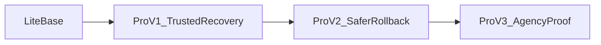

# Museder RestoreOne PRO Master Plan

> Purpose: This document is a shared source for product strategy, development planning, website copy, and sales collateral.
>
> 用途：本文件同時作為產品策略、開發規劃、網站頁面說明與銷售文宣的共同母稿。

## 1. Executive Summary / 執行摘要

`Museder RestoreOne PRO` should not compete as a generic "more backup features" plugin.

`Museder RestoreOne PRO` 不應該以「比別人多幾個備份功能」來競爭。

The strongest market position is:

最有機會打動市場的定位是：

**Verified Recovery + Restore Safety**

**可驗證恢復 + 安全還原**

In plain language:

用白話來說就是：

- Your backup is not just created, it is more trustworthy to recover from.
- You do not restore blindly; you understand likely impact before you proceed.
- Dynamic sites and WooCommerce stores get a safer path to recover without casually risking newer data.

- 你的備份不只是「有做出來」，而是更值得信任、真的能拿來救站。
- 你不是盲目還原，而是在操作前就先理解可能影響。
- 動態網站與 WooCommerce 商店能以更低風險的方式回復，不再輕易賭上新資料。

This gives Museder RestoreOne PRO a clearer identity than cloud storage, retention rules, or generic AI analysis alone.

這個定位比單做雲端備份、保留策略或泛用 AI 分析，更能讓 Museder RestoreOne PRO 被市場記住。

## 2. Product Thesis / 產品命題

### 2.1 One-line Positioning / 一句話定位

**English**

Museder RestoreOne PRO is a safer recovery workflow for WordPress and WooCommerce.

**中文**

Museder RestoreOne PRO 是專為 WordPress 與 WooCommerce 設計的低風險恢復方案。

### 2.2 Expanded Positioning / 延伸定位

**English**

Most backup plugins sell storage, scheduling, and destinations. Museder RestoreOne PRO should sell confidence at the moment of restore: verified backups, clearer restore decisions, safer rollback workflows, and staged expansion toward dynamic-data-safe recovery.

**中文**

多數備份外掛賣的是儲存位置、排程與備份目的地；Museder RestoreOne PRO 應該賣的是「還原當下的信心」：可驗證的備份、更清楚的還原判斷、更安全的回復流程，以及逐步擴張到動態資料保護能力。

### 2.3 What We Are Not / 我們不是什麼

Museder RestoreOne PRO should not initially position itself as:

Museder RestoreOne PRO 初期不應定位成：

- another all-purpose cloud backup plugin
- another reporting dashboard with weak recovery value
- another AI add-on with vague recommendations
- another enterprise multi-site platform before the core recovery story is proven

- 另一個泛用型雲端備份外掛
- 另一個只有儀表板與報表、但恢復價值薄弱的工具
- 另一個只有模糊建議的 AI 附加功能
- 在核心恢復故事未被驗證前，就想先做成企業級多站平台

## 3. Existing Product Baseline / 現有產品基線

### 3.1 Lite Strengths / Lite 既有優勢

Current Lite positioning already has a strong foundation:

目前 Lite 已有不錯的基礎：

- single-archive full-site backup
- guided 3-step restore center
- chunked upload and validation
- shared-hosting-friendly restore pipeline
- schedule and log management
- safe mode and restore reliability improvements

- 單一壓縮檔的完整站點備份
- 引導式三步驟還原中心
- 分片上傳與完整性驗證
- 對共享主機友善的備份與還原流程
- 排程與日誌管理
- Safe Mode 與一系列還原可靠性修正

### 3.2 Existing PRO Scaffolding / 現有 PRO 骨架

The codebase already includes early scaffolding for:

目前程式中已經有以下 PRO 骨架：

- `includes/class-pro.php`: basic PRO activation and feature gating
- `includes/pro/cloud-storage.php`: provider list and upload placeholders
- `includes/pro/ai-service.php`: health score, anomaly detection, restore summary placeholders
- `includes/pro/reports-service.php`: system checks, trend data, JSON report export
- `includes/pro/smart-retention.php`: recommendation and policy placeholders
- `templates/page-pro-*.php`: currently mostly unavailable-state placeholders

- `includes/class-pro.php`：基本 PRO 啟用與功能鎖定
- `includes/pro/cloud-storage.php`：雲端目的地與上傳預留骨架
- `includes/pro/ai-service.php`：健康分數、異常偵測、還原摘要預留
- `includes/pro/reports-service.php`：系統檢查、趨勢資料與 JSON 報告匯出
- `includes/pro/smart-retention.php`：保留策略建議與執行預留
- `templates/page-pro-*.php`：目前多半還是 unavailable 頁面

### 3.3 Strategic Implication / 策略意義

This means PRO planning should not start from zero. However, the current scaffolding follows a conventional feature bucket model. The new plan should reorganize those buckets under a stronger narrative:

這代表 PRO 不是從零開始；但目前骨架偏向傳統功能分類。新規劃要做的，不是只把骨架填滿，而是把它們重新編入更有力的敘事：

- Verified Recovery
- Restore Preview
- Safe Restore Workflow
- Dynamic Data Protection
- Operational Trust

- 可驗證恢復
- 還原前預覽
- 安全還原流程
- 動態資料保護
- 維運信任感

## 4. Market Segments / 目標客群

### 4.1 Segment Ranking / 客群優先順序

#### Segment A: WooCommerce and Dynamic Sites

**Why this segment matters**

- They lose revenue if recovery goes wrong.
- They fear losing orders, members, bookings, or recent submissions.
- They understand the value of safer restore workflows quickly.

**中文**

- 這群人一旦恢復失敗，就不是單純技術問題，而是營收損失。
- 他們最怕的是訂單、會員、預約、近期表單資料被回滾。
- 他們最快能理解「安全還原」的價值，也最有機會快速付費。

#### Segment B: Small Agencies and Maintenance Providers

**Why this segment matters**

- They handle repeated update and restore risk across many sites.
- They value proof, process, and lower operational anxiety.
- They are strong candidates for future Agency tier expansion.

**中文**

- 他們在多站維運裡會反覆面對更新與回復風險。
- 他們重視流程、證明、降低事故壓力。
- 也最適合作為後續 Agency 方案的擴張對象。

#### Segment C: General WordPress Site Owners

**Why this segment matters**

- This is the largest top-of-funnel market.
- They are ideal for free-to-PRO conversion.
- They are not the fastest to pay, but they provide the widest acquisition pool.

**中文**

- 這是最大的流量池。
- 最適合從免費版導流升級 PRO。
- 雖然不是最快掏錢，但最適合作為長期成長入口。

### 4.2 Purchase Triggers / 購買觸發點

Users do not buy backup tools only because they love backup features. They buy when risk becomes concrete.

使用者不是因為喜歡備份功能才買單，而是在風險變得具體時才願意掏錢。

Primary triggers:

主要觸發點：

- "I do not know whether this backup is actually recoverable."
- "I am afraid of restoring because I do not know what will be overwritten."
- "A plugin or theme update could break my site."
- "I cannot afford to lose new orders or newer content."
- "I need proof and process, not just files."

- 「我不知道這個備份到底能不能真的還原。」
- 「我不敢還原，因為不知道會覆蓋掉什麼。」
- 「一次外掛或主題更新就可能把站點弄壞。」
- 「我不能接受新訂單或新內容被回滾掉。」
- 「我要的是流程與證明，不只是備份檔案。」

## 5. Competitive Positioning / 競品差異化判斷

### 5.1 Features That Are Necessary but Not Differentiating / 必要但不夠差異化的功能

These should exist in PRO, but they should not be the lead story:

這些功能應該存在於 PRO，但不應作為第一主賣點：

- cloud destinations
- advanced retention rules
- basic or advanced reports
- generic AI recommendations
- broader backup automation

- 雲端目的地
- 進階保留策略
- 基本或進階報表
- 泛用 AI 建議
- 更完整的備份自動化

### 5.2 Differentiators That Can Move the Market / 真正能撬動市場的差異點

#### 1. Verified Recovery / 可驗證恢復

Backups should not be presented as finished just because they were generated.

備份不應該只因為「產生完成」就被視為任務結束。

Core message:

核心訊息：

- Backup success is not enough.
- Recovery confidence is the product.

- 備份成功不等於恢復成功。
- 「可恢復的信心」才是產品本體。

#### 2. Restore Impact Preview / 還原影響預覽

Users need to understand likely consequences before they click restore.

使用者在按下還原前，需要先理解可能後果。

Core message:

核心訊息：

- Stop blind restore.
- Preview likely changes before recovery.

- 停止盲還原。
- 在恢復前先預覽可能變更。

#### 3. Safe Update Protection / 安全更新保護

Updates are a more frequent risk event than full disaster recovery.

更新失敗比真正的災難復原更常發生。

Core message:

核心訊息：

- Every update should have a safer rollback path.

- 每一次更新都該先留下更安全的回退路徑。

#### 4. Transaction-Safe Recovery / 交易型資料安全恢復

Dynamic sites care about what happened after the restore point.

動態網站最在意的是 restore point 之後又新增了什麼資料。

Core message:

核心訊息：

- Fix the site without casually sacrificing recent business data.

- 修好網站，不要順便賭掉近期商業資料。

#### 5. Recovery Drill and Proof / 恢復演練與證明

For advanced customers, tested recovery matters more than backup rhetoric.

對進階客群來說，被驗證過的恢復能力，比「我們有備份」這種說法重要得多。

## 6. Product Pillars / 產品支柱

### Pillar A: Trust the Backup / 相信你的備份

- verification status
- readiness checks
- structural integrity validation
- future test-restore workflow

- 驗證狀態
- 恢復就緒檢查
- 結構完整性驗證
- 未來可延伸到 test restore 流程

### Pillar B: Understand Before Restore / 還原前先理解

- restore preview
- likely overwrite summary
- plugin/theme differences
- domain/path/config warnings

- 還原預覽
- 可能覆蓋摘要
- 外掛/主題差異提示
- 網域/路徑/設定警告

### Pillar C: Recover with Less Risk / 用更低風險的方式恢復

- safe update protection
- safer rollback workflow
- dynamic-data-aware restore strategy

- 安全更新保護
- 更安全的回退流程
- 具備動態資料意識的還原策略

### Pillar D: Prove Operational Maturity / 證明維運成熟度

- reports that show recovery readiness
- drill evidence
- agency-ready proof and delivery

- 顯示恢復就緒程度的報告
- 演練證據
- 面向代理商的交付與證明

## 7. Tier Strategy / 版本分層策略

### 7.1 Lite

**Purpose**

Acquire users, prove reliability, and let them experience the restore workflow.

**中文**

吸引用戶、證明基礎可靠性，讓使用者先體驗 RestoreOne 的還原流程。

**Suggested Lite boundary / 建議 Lite 邊界**

- manual full backup
- guided restore flow
- chunk upload
- basic schedules
- logs
- safe mode
- essential restore reliability

- 手動完整備份
- 引導式還原流程
- 分片上傳
- 基本排程
- 日誌
- Safe Mode
- 核心還原可靠性

### 7.2 PRO

**Purpose**

Sell confidence, safer decisions, and lower-risk recovery.

**中文**

販售信心、降低決策焦慮、提供更低風險的恢復能力。

**Suggested PRO boundary / 建議 PRO 邊界**

- verified recovery checks
- restore impact preview
- cloud storage destinations
- advanced retention
- richer reports
- safe update protection
- selective restore expansion
- dynamic-data protection path

- 可驗證恢復檢查
- 還原影響預覽
- 雲端備份目的地
- 進階保留策略
- 更完整報表
- 安全更新保護
- 局部還原擴充
- 動態資料保護能力

### 7.3 Agency

**Purpose**

Sell proof, scale, and operational delivery.

**中文**

販售可交付性、規模化流程與維運證明。

**Suggested Agency boundary / 建議 Agency 邊界**

- recovery drill workflows
- restore proof reports
- white-label deliverables
- future multi-site or policy templates
- priority support and operational tooling

- 恢復演練流程
- 恢復證明報告
- 白標交付物
- 未來的多站或策略模板能力
- 優先支援與維運工具

## 8. Product Roadmap / 產品路線圖

### 8.1 PRO v1: Trusted Recovery / 可信恢復

**Goal / 目標**

Make users trust the backup and feel safer before restore.

讓使用者更相信備份、並在還原前更安心。

**Core features / 核心功能**

- verified recovery status
- backup integrity/readiness checks
- restore impact preview
- restore risk summary
- basic cloud storage
- advanced retention basics
- upgraded reports framing around trust and readiness

- 備份驗證狀態
- 備份完整性/恢復就緒檢查
- 還原影響預覽
- 還原風險摘要
- 基本雲端目的地
- 進階 retention 基礎版
- 以可信與 readiness 為導向的報表

**Why v1 / 為什麼先做這一波**

- strongest combined commercial message
- aligned with current restore architecture
- easier to ship credibly than dynamic order preservation

- 商業訊息最集中
- 與現有 restore 架構最相容
- 比動態訂單保留更容易做出可信版本

### 8.2 PRO v2: Safer Rollback / 更安全的回退

**Goal / 目標**

Turn recovery trust into update and rollback protection.

把恢復信任延伸成更新保護與回退能力。

**Core features / 核心功能**

- pre-update snapshot workflow
- update protection UI and guidance
- selective restore expansion
- dynamic-data-safe warnings and policy options
- early WooCommerce-safe recovery tooling

- 更新前快照流程
- 更新保護 UI 與提示
- 局部還原擴充
- 動態資料安全警示與策略選項
- 初階 WooCommerce 安全恢復工具

### 8.3 PRO v3 or Agency: Recovery Governance / 恢復治理

**Goal / 目標**

Convert operational trust into proof and repeatable delivery.

把恢復信任進一步轉化為可證明、可交付的維運能力。

**Core features / 核心功能**

- recovery drills
- readiness proof
- client-facing reports
- agency and white-label outputs

- 恢復演練
- readiness 證明
- 面向客戶的報告
- Agency/白標輸出

## 9. Development Planning / 開發導向規劃

### 9.1 Reuse Current Modules / 可沿用現有模組

#### `includes/class-pro.php`

Keep this as the central gate for feature access, but expand from a simple on/off model to named capability flags.

保留為 PRO 功能入口，但應從單純開關，擴充為具名 capability flags 的集中控管。

#### `includes/pro/ai-service.php`

Repurpose this module away from vague AI novelty and toward:

此模組不應主打模糊 AI 新奇感，而應轉向：

- restore summary generation
- risk explanation
- anomaly grouping
- recommendation translation for non-technical users

- 還原摘要生成
- 風險解讀
- 異常分群
- 對非技術使用者的建議翻譯

#### `includes/pro/reports-service.php`

This should evolve from generic trend reporting into trust-oriented reporting:

此模組應從一般趨勢報表，轉型為信任導向報表：

- recovery readiness summary
- validation status
- restore risk digest
- later proof-oriented exports

- 恢復就緒摘要
- 驗證狀態
- 還原風險摘要
- 後續可延伸為 proof 導向輸出

#### `includes/pro/cloud-storage.php`

Cloud remains important, but it should support the trust story:

雲端依然重要，但應支援 trust story，而不是搶主軸：

- off-site safety
- schedule destination support
- optional redundancy layer

- 異地安全
- 排程目的地支援
- 額外冗餘層

#### `includes/pro/smart-retention.php`

Position retention as operational hygiene:

retention 應定位為維運衛生與成本控制：

- smarter cleanup
- suggested policies
- storage-risk mitigation

- 更聰明的清理
- 建議策略
- 儲存風險緩解

### 9.2 New Modules Likely Needed / 可能需要新增的模組

#### Verified Recovery

Possible future modules:

可預期需要的模組：

- backup validation service
- backup readiness evaluator
- verification status registry

- 備份驗證服務
- 恢復就緒評估器
- 驗證狀態登錄

#### Restore Preview

Possible future modules:

可預期需要的模組：

- restore preview analyzer
- backup-vs-current diff summarizer
- warning classifier

- 還原預覽分析器
- 備份與目前站點差異摘要器
- 警示分類器

#### Safe Update Protection

Possible future modules:

可預期需要的模組：

- update snapshot controller
- update rollback orchestration
- update event tracking

- 更新快照控制器
- 更新回退協調器
- 更新事件追蹤

#### Dynamic Data Protection

Possible future modules:

可預期需要的模組：

- WooCommerce-aware data map
- transaction-safe table policy layer
- selective merge or preserve strategy engine

- WooCommerce 資料感知地圖
- 交易型資料表策略層
- 選擇性合併或保留策略引擎

### 9.3 Relative Risk by Capability / 能力風險排序

#### Lower risk

- verified recovery status
- readiness checks
- restore preview summaries
- trust-oriented reports

- 備份驗證狀態
- readiness 檢查
- 還原預覽摘要
- 信任導向報表

#### Medium risk

- safe update workflow
- snapshot orchestration
- advanced selective restore

- 安全更新流程
- 快照協調
- 進階局部還原

#### Highest risk

- preserve latest WooCommerce orders and member data
- partial merge logic on dynamic tables
- transactional recovery guarantees

- 保留 WooCommerce 新訂單與會員資料
- 動態資料表的局部合併邏輯
- 交易型恢復保證

### 9.4 Suggested Development Order / 建議開發順序

1. define feature taxonomy and copy framing
2. implement verified recovery status model
3. implement restore preview summary pipeline
4. redesign PRO UI around trust and preview
5. integrate cloud, retention, and reports under the new story
6. design safe update workflow
7. design dynamic-data-safe recovery for WooCommerce
8. expand into drill/proof deliverables

1. 先定義功能分類與文案語意
2. 實作備份驗證狀態模型
3. 實作還原預覽摘要流程
4. 以 trust 與 preview 為主重做 PRO UI
5. 把 cloud、retention、reports 整併進新故事
6. 設計安全更新流程
7. 設計 WooCommerce 動態資料安全恢復
8. 再擴張到演練/證明交付

### 9.5 Existing File Touch Map / 既有檔案調整地圖

The current repository already points to likely integration points for the first wave.

目前 repo 已經能看出第一波整合的大致落點。

#### Core gating and feature registration / 核心權限與功能註冊

- `includes/class-pro.php`
- `museder-restoreone.php`
- `includes/class-ui.php`

Use these files to define capability flags, menu exposure, localized feature metadata, and PRO-aware UI state.

可用來定義 capability flags、選單顯示、前端所需的功能 metadata，以及 PRO-aware UI 狀態。

#### Restore workflow and orchestration / 還原流程與協調

- `includes/class-restore-service.php`
- `includes/class-restore-handler.php`
- `includes/class-restore-controller.php`
- `includes/class-restore-jobs.php`
- `includes/class-restore-report.php`
- `templates/page-restore.php`
- `assets/js/admin-ui.js`
- `assets/js/admin.js`

These are the most likely places for `Restore Preview`, `Restore Risk Summary`, restore status surfaces, and future safe-rollback hooks.

這些檔案最可能承接 `Restore Preview`、`Restore Risk Summary`、還原狀態呈現，以及未來的 safe rollback hook。

#### PRO service layer / PRO 服務層

- `includes/pro/ai-service.php`
- `includes/pro/reports-service.php`
- `includes/pro/cloud-storage.php`
- `includes/pro/smart-retention.php`

These should be reorganized around the new product story instead of staying as isolated feature silos.

這些檔案應從孤立功能桶，重新整理成新的產品敘事支柱。

#### PRO screens and upgrade messaging / PRO 頁面與升級訊息

- `templates/page-pro-features.php`
- `templates/page-pro-ai.php`
- `templates/page-pro-cloud.php`
- `templates/page-pro-reports.php`
- `templates/page-pro-retention.php`
- `assets/js/admin-ui.js`

The current unavailable-state screens should evolve into narrative-driven PRO pages, feature overview screens, or actionable upgrade prompts tied to recovery trust.

目前的 unavailable 頁面，後續應改成以恢復信任為核心的 PRO 頁面、功能總覽頁，或可操作的升級引導。

### 9.6 Implementation Topics to Split Next / 下一步可拆分的實作主題

The master plan should be broken into smaller implementation topics for execution.

這份總規劃接下來應被拆成更小的 implementation topics 執行。

#### Topic 1: PRO Feature Taxonomy and Capability Flags

- define named capabilities such as `verified_recovery`, `restore_preview`, `cloud_destinations`, `safe_update`
- centralize access rules in `includes/class-pro.php`
- align PHP, JS, and template-level feature exposure

- 定義具名能力，如 `verified_recovery`、`restore_preview`、`cloud_destinations`、`safe_update`
- 在 `includes/class-pro.php` 集中管理存取規則
- 對齊 PHP、JS 與 template 的功能曝光方式

#### Topic 2: Verified Recovery Status Model

- define what "verified" means in v1
- add backup validation metadata
- expose status in backup list, reports, and future PRO screens

- 定義 v1 中「verified」的具體標準
- 新增備份驗證 metadata
- 在備份列表、報表與未來 PRO 畫面顯示狀態

#### Topic 3: Restore Preview and Risk Summary

- analyze selected backup vs current environment
- summarize likely overwrite areas
- surface warnings in `templates/page-restore.php`

- 分析選定備份與目前環境差異
- 摘要可能被覆蓋的區塊
- 在 `templates/page-restore.php` 顯示風險提示

#### Topic 4: PRO UI Reframing

- replace unavailable placeholders with value-led PRO pages
- connect feature pages to the new trust-based narrative
- align modal/upgrade copy in `assets/js/admin-ui.js`

- 將 unavailable 頁面改為價值導向的 PRO 頁面
- 讓功能頁與新的 trust 敘事一致
- 對齊 `assets/js/admin-ui.js` 中的 modal/upgrade 文案

#### Topic 5: Cloud, Retention, and Reports as Support Layers

- keep these in PRO, but rewrite their UI and descriptions to support trusted recovery
- avoid presenting them as the main reason to upgrade

- 這些功能保留在 PRO 中，但 UI 與文案要重新支援 trusted recovery 故事
- 避免把它們塑造成最主要的升級理由

#### Topic 6: Safe Update Protection Design

- define pre-update snapshot lifecycle
- define rollback entry points
- decide how much v2 depends on existing restore jobs

- 定義更新前快照生命週期
- 定義回退入口點
- 判斷 v2 要多大程度依賴現有 restore jobs

#### Topic 7: Dynamic Data Protection Research Track

- map WooCommerce and future membership/plugin data tables
- define what can be warned about in v2 before promising preservation
- separate warning-grade features from guarantee-grade features

- 建立 WooCommerce 與未來會員/商業外掛資料表地圖
- 在承諾 preservation 前，先定義 v2 能做到哪些 warning 級功能
- 把 warning 等級功能與 guarantee 等級功能明確分開

### 9.7 Minimum Acceptance Criteria by Phase / 各階段最低驗收條件

These criteria are intended to help engineering and product avoid ambiguous execution.

這些條件用來幫工程與產品避免模糊實作。

#### PRO v1 acceptance criteria / PRO v1 驗收條件

- the product can express a defined verification state for a backup
- the restore flow can display a meaningful preview or risk summary before execution
- PRO messaging across admin UI is aligned with `Verified Recovery + Restore Safety`
- cloud, retention, and reports are framed as support layers, not primary upgrade hooks
- the user can distinguish Lite restore capability from PRO trust capability

- 產品能為備份表達明確的驗證狀態
- 還原流程能在執行前顯示有意義的 preview 或風險摘要
- 後台中的 PRO 訊息已對齊 `Verified Recovery + Restore Safety`
- cloud、retention、reports 被定位為支援層，而不是主要升級鉤子
- 使用者能清楚理解 Lite 的 restore 能力與 PRO 的 trust 能力差異

#### PRO v2 acceptance criteria / PRO v2 驗收條件

- there is a defined pre-update safety workflow
- selective restore or safer rollback scope is clearer than full-site restore only
- dynamic-data-related warnings are explicit and do not overpromise preservation
- WooCommerce-oriented safety value is visible in copy and workflow

- 已定義更新前安全流程
- 局部還原或更安全回退的範圍，比單純整站還原更清楚
- 與動態資料有關的 warnings 已明確，且不過度承諾 preservation
- WooCommerce 導向的安全價值已在文案與流程中可見

#### PRO v3 or Agency acceptance criteria / PRO v3 或 Agency 驗收條件

- recovery drill and proof concepts are operationally defined
- exported reports can support partner, agency, or client-facing delivery
- the plan can support future white-label or multi-site expansion without rewriting the core product story

- 恢復演練與 proof 概念已有操作層定義
- 匯出報告能支援合作夥伴、代理商或客戶交付
- 不重寫核心產品故事的前提下，已能支撐未來白標或多站擴張

## 10. Website and Sales Messaging / 網站與銷售文案

### 10.1 Hero Copy / 首屏主文案

#### Option A

**EN headline**

Backup is not the goal. Recovering safely is.

**EN subheadline**

Museder RestoreOne PRO helps WordPress and WooCommerce teams verify backups, preview restore impact, and recover with more confidence.

**ZH headline**

備份不是重點，安全救回來才是。

**ZH subheadline**

Museder RestoreOne PRO 協助 WordPress 與 WooCommerce 團隊驗證備份、預覽還原影響，並用更有信心的方式完成恢復。

#### Option B

**EN headline**

The safer recovery workflow for WordPress and WooCommerce.

**EN subheadline**

Move from backup files to verified recovery, restore preview, and lower-risk rollback decisions.

**ZH headline**

專為 WordPress 與 WooCommerce 設計的安全恢復流程。

**ZH subheadline**

從單純備份檔，升級為可驗證恢復、還原預覽與更低風險的回退決策。

### 10.2 Three Core Value Blocks / 三大核心賣點

#### Block 1

**EN title**

Know your backup is ready

**EN copy**

Stop relying on hope. Museder RestoreOne PRO is designed to help you understand whether a backup is more likely ready for recovery before you need it.

**ZH title**

先知道備份能不能拿來救

**ZH copy**

不要再靠運氣。Museder RestoreOne PRO 要解決的，是讓你在真正出事之前，就更清楚這份備份是否已經做好恢復準備。

#### Block 2

**EN title**

Preview restore impact first

**EN copy**

Understand likely overwrite risks, environment differences, and recovery warnings before you click restore.

**ZH title**

還原前先看影響

**ZH copy**

在按下還原前，先了解可能的覆蓋風險、環境差異與恢復警示，不再盲目操作。

#### Block 3

**EN title**

Recover with less risk

**EN copy**

Build toward safer rollback, update protection, and dynamic-data-aware recovery for business-critical sites.

**ZH title**

用更低風險的方式恢復

**ZH copy**

逐步建立更安全的回退流程、更新保護，以及適合商業站點的動態資料感知恢復能力。

### 10.3 Feature Comparison Direction / 功能比較表方向

Recommended columns:

建議欄位：

- Lite
- PRO
- Agency

Recommended rows:

建議列項：

- Full-site backup
- Guided restore wizard
- Chunked upload
- Safe mode
- Verified recovery status
- Restore impact preview
- Cloud destinations
- Advanced retention
- Trust-oriented reports
- Safe update protection
- Dynamic-data-safe recovery
- Recovery drills and proof
- White-label deliverables

- 完整站點備份
- 引導式還原精靈
- 分片上傳
- Safe Mode
- 備份驗證狀態
- 還原影響預覽
- 雲端目的地
- 進階 retention
- 信任導向報表
- 安全更新保護
- 動態資料安全恢復
- 恢復演練與證明
- 白標交付

### 10.4 CTA Direction / 行動呼籲方向

**EN**

- Upgrade to safer recovery
- See what restore confidence looks like
- Move beyond backup-only workflows

**ZH**

- 升級到更安全的恢復流程
- 看看真正有信心的還原體驗
- 從只有備份，走向更完整的恢復能力

### 10.5 Suggested Page IA / 建議頁面資訊架構

This section turns the messaging into a page-building outline.

這一節把文案進一步轉成可做頁面的結構藍圖。

#### Section 1: Hero

- use `10.1 Hero Copy`
- include one primary CTA and one secondary CTA
- visual emphasis should reinforce safer restore, not generic cloud storage

- 使用 `10.1 Hero Copy`
- 放一個主 CTA 與一個次 CTA
- 視覺重點應強化 safer restore，而不是泛用 cloud storage

#### Section 2: Problem Framing

- explain why backup success is not the same as recovery confidence
- highlight fear of blind restore, failed updates, and newer data loss

- 說明備份成功不等於恢復信心
- 點出盲還原、更新炸站與新資料回滾的焦慮

#### Section 3: Three Core Value Blocks

- use `10.2 Three Core Value Blocks`
- each block should connect to one product pillar

- 使用 `10.2 Three Core Value Blocks`
- 每一個區塊都對應一條產品支柱

#### Section 4: Lite vs PRO vs Agency Comparison

- use `10.3 Feature Comparison Direction`
- place this after value blocks so pricing/upgrade context feels earned

- 使用 `10.3 Feature Comparison Direction`
- 放在賣點區之後，讓升級與定價脈絡更自然

#### Section 5: Roadmap and Trust Statement

- summarize `PRO v1`, `v2`, `v3`
- explicitly state which advanced protections are roadmap items

- 摘要 `PRO v1`、`v2`、`v3`
- 明確說明哪些進階保護仍屬 roadmap

#### Section 6: FAQ and Objection Handling

- use `11. FAQ and Objection Handling`
- keep answers honest and aligned with actual implementation maturity

- 使用 `11. FAQ and Objection Handling`
- 回答應誠實，並與實際實作成熟度一致

#### Section 7: Final CTA

- reuse CTA language from `10.4 CTA Direction`
- close on confidence, not fear-only messaging

- 重用 `10.4 CTA Direction` 的 CTA 語句
- 收尾應落在 confidence，而不是只靠 fear 驅動

## 11. FAQ and Objection Handling / FAQ 與常見疑慮處理

### Q1. Isn’t this just another backup plugin?

**EN**

No. Museder RestoreOne PRO is positioned around recovery confidence, not only storage and scheduling. The focus is on verifying readiness, previewing restore impact, and lowering recovery risk.

**ZH**

不是。Museder RestoreOne PRO 的重點不是只有儲存與排程，而是恢復信心：更重視驗證 readiness、預覽還原影響，以及降低恢復風險。

### Q2. Why should I pay if Lite already backs up and restores?

**EN**

Lite helps you create and restore backups. PRO is for the moment when uncertainty becomes expensive: when you need stronger confidence, safer decisions, and lower-risk recovery workflows.

**ZH**

Lite 能幫你建立與執行基本備份還原；PRO 則是為了處理「不確定性開始變得昂貴」的時刻，當你需要更高信心、更安全判斷與更低風險的恢復流程時，PRO 才是關鍵。

### Q3. Is cloud backup the main PRO reason?

**EN**

Cloud storage matters, but it is not the main story. It supports off-site safety. The main story is trusted recovery.

**ZH**

雲端很重要，但不是最主要的理由。它是異地安全的支援層，真正的主軸是可信恢復。

### Q4. Is this only for WooCommerce?

**EN**

No. The core promise helps all WordPress sites. WooCommerce and dynamic-data sites simply feel the pain faster, so they are a strong commercial beachhead.

**ZH**

不是。核心價值對所有 WordPress 站點都成立，只是 WooCommerce 與動態資料站更快感受到風險，因此更適合成為商業切入點。

### Q5. Will PRO immediately guarantee no order loss?

**EN**

Not in v1. The roadmap should communicate clearly: v1 focuses on trust and restore preview; advanced dynamic-data protection comes later and must be implemented carefully.

**ZH**

不會在 v1 就直接承諾這件事。路線圖必須清楚說明：v1 先解決 trust 與 restore preview；更進階的動態資料保護會在後續階段謹慎推出。

## 12. Messaging Rules / 對外溝通原則

- Do not overclaim guarantees that the product has not implemented.
- Lead with safer recovery, not with feature count.
- Avoid vague AI-first messaging.
- Explain roadmap honestly when discussing dynamic data protection.
- Keep Lite and PRO messaging consistent with WordPress.org expectations.

- 不要超前承諾尚未實作的保證。
- 對外主軸應是更安全的恢復，而不是功能數量。
- 避免空泛的 AI 優先話術。
- 談到動態資料保護時，要誠實說明 roadmap 階段。
- Lite 與 PRO 文案需維持與 WordPress.org 期望一致的中立與一致性。

## 13. Content Reuse Map / 內容再利用地圖

This document can be split into:

本文件後續可以拆成：

- website hero copy
- PRO landing page sections
- Lite vs PRO comparison table
- sales deck summary
- product FAQ
- future investor/partner overview
- development roadmap reference
- implementation plan inputs

- 官網首屏文案
- PRO landing page 區塊
- Lite vs PRO 功能比較表
- 銷售簡報摘要
- 產品 FAQ
- 對外合作或介紹簡報
- 開發 roadmap 參考文件
- 後續 implementation plan 輸入素材

## 14. Free / PRO Split Strategy / Free 與 PRO 分拆策略

This section is for internal architecture planning only. It should guide engineering, release, and WP.org review strategy, but it should not be reused as public-facing sales copy.

本節僅供內部架構規劃使用。它應作為工程、發版與 WP.org 審核策略的依據，但不應直接轉用為對外銷售文案。

### 14.1 Why the Split Should Be Planned / 為什麼要正式規劃分拆

Museder RestoreOne currently behaves like a single-codebase product with conditional PRO loading. That is workable in the short term, but it creates long-term pressure in review, packaging, and maintenance.

Museder RestoreOne 目前本質上仍是單一碼庫、條件式載入 PRO 的產品。短期可行，但長期會在審核、打包與維護上持續增加壓力。

The split strategy should exist to:

分拆策略應服務以下目標：

- keep the WP.org Free build cleaner and reviewer-friendly
- reduce commercial feature noise inside the Free package
- let PRO evolve faster without turning the Free package into a mixed-purpose bundle
- move toward a healthier add-on architecture over time

- 讓 WP.org 的 Free build 更乾淨、更 reviewer-friendly
- 降低 Free 套件內的商業功能噪音
- 讓 PRO 能更快演進，而不把 Free 套件變成混合用途的 bundle
- 逐步走向更健康的 add-on 架構

### 14.2 Target Architecture / 目標架構

The recommended target is not two unrelated plugins. The recommended target is:

建議的目標不是兩套互不相干的外掛，而是：

- `Museder RestoreOne` = Free core plugin
- `Museder RestoreOne PRO` = add-on plugin that depends on the Free core

- `Museder RestoreOne` = Free 核心外掛
- `Museder RestoreOne PRO` = 依附 Free 核心啟動的 add-on 外掛

The Free core should own:

Free core 應負責：

- backup engine
- restore engine
- jobs, logs, schedules, core UI, and shared data structures

- 備份引擎
- 還原引擎
- jobs、logs、schedules、核心 UI 與共享資料結構

The PRO add-on should own:

PRO add-on 應負責：

- verified recovery layers
- restore preview layers
- trust-oriented reports
- cloud and retention enhancements
- future safe update and dynamic-data protection extensions

- 可驗證恢復層
- 還原預覽層
- trust 導向報表
- cloud 與 retention 增強功能
- 未來的安全更新與動態資料保護擴充

### 14.3 Two-Phase Split Plan / 二階段拆分計畫

#### Phase 1: Logical Separation / 第一階段：邏輯分離

Do this before any physical packaging changes. Phase 1 is explicitly not the time to split Free and PRO into two separate plugin packages.

先做邏輯分離，再做實體拆包。第一階段明確不是把 Free 與 PRO 拆成兩支獨立外掛的時機。

Goals:

目標：

- define shared extension points in the Free core
- move scattered PRO condition checks toward a capability-based model
- reduce direct PRO assumptions inside shared core flows
- prepare the codebase so PRO can be removed from the Free package later without breaking the core

- 在 Free core 中定義共享 extension points
- 把散落各處的 PRO 判斷，逐步收斂成 capability-based model
- 降低共享核心流程內對 PRO 的直接假設
- 讓未來把 PRO 從 Free 套件移出時，不會破壞 core

Important rule for initial PRO development:

初始 PRO 開發的重要原則：

- PRO can be developed during Phase 1, but it must still behave as part of the shared codebase
- new PRO features should avoid deep coupling to unstable core internals when possible
- every new PRO capability should be implemented with future extraction in mind

- PRO 在第一階段可以同步開發，但仍應視為共享碼庫的一部分
- 新增的 PRO 功能應盡量避免深度耦合到不穩定的核心內部
- 每一個新 PRO 能力都應以未來可抽離為前提來設計

Suggested focus:

建議優先處理：

- `includes/class-pro.php`
- `museder-restoreone.php`
- `includes/class-ui.php`
- backup/restore entry points that currently branch on PRO state

- `includes/class-pro.php`
- `museder-restoreone.php`
- `includes/class-ui.php`
- 目前會依 PRO 狀態分支的 backup/restore 入口

#### Phase 2: Physical Separation / 第二階段：實體分離

After the logical boundaries are stable, move PRO into its own plugin package.

當邏輯邊界穩定後，再把 PRO 移到獨立外掛套件。

This is the first stage where actual plugin separation should happen.

真正的外掛實體分拆，應在這個第二階段才開始進行。

Goals:

目標：

- create a dedicated `museder-restoreone-pro` plugin package
- require the Free plugin to be installed and active
- keep compatibility checks explicit between Free and PRO versions
- keep WP.org build and commercial build packaging separate

- 建立獨立的 `museder-restoreone-pro` 外掛套件
- 要求 Free 外掛已安裝並啟用
- Free 與 PRO 版本相容檢查明確化
- 將 WP.org build 與商業 build 的打包流程正式分開

### 14.4 Review-Safe Strategy During the Split / 分拆期間的送審安全策略

While Free is still under WP.org review, the split should prioritize stability over purity.

在 Free 仍處於 WP.org 送審期間時，分拆策略應優先重視穩定，而不是追求一次到位的架構純化。

Rules:

原則：

- do not rewrite the restore engine only to satisfy packaging elegance
- do not fork Free and PRO into separate parallel cores
- keep reviewer-facing Free builds simple, quiet, and policy-aligned
- keep external service disclosures accurate and limited to actual behavior

- 不要只為了打包漂亮，就重寫 restore engine
- 不要把 Free 與 PRO 分叉成兩套平行核心
- reviewer 看到的 Free build 應保持簡單、低噪音、符合政策
- 外部服務揭露要精準，且只對應實際行為

### 14.5 Risks to Avoid / 要避免的風險

- two diverging codebases with duplicated bug-fix work
- incompatible data structures between Free and PRO
- PRO reaching too deeply into unstable shared core internals
- over-promising commercial separation before the architecture is ready

- 兩套逐漸分叉的 codebase，導致 bug fix 重複修補
- Free 與 PRO 使用不相容的資料結構
- PRO 過度深入不穩定的共享核心內部
- 在架構尚未準備好前，就過早承諾商業版完全分離

### 14.6 Deliverables After This Strategy / 本策略後續應拆出的文件

This strategy should eventually lead to:

本策略後續應拆出：

1. `free-pro-split-implementation-plan`
2. `free-pro-compatibility-policy`
3. `review-safe-build-and-release-strategy`

1. `free-pro-split-implementation-plan`
2. `free-pro-compatibility-policy`
3. `review-safe-build-and-release-strategy`

## 15. Recommended Next Documents / 建議下一步文件

After this master plan, create the following documents:

完成本總規劃後，建議接著拆出以下文件：

1. `docs/plans/2026-03-12-museder-restoreone-pro-v1-implementation-plan.md`
2. `docs/plans/2026-03-12-museder-restoreone-pro-website-copy.md`
3. `docs/plans/2026-03-12-museder-restoreone-pro-lite-vs-pro-matrix.md`
4. `docs/plans/2026-03-12-museder-restoreone-pro-feature-taxonomy.md`

## 16. Final Recommendation / 最終建議

If Museder RestoreOne PRO tries to win by matching every mature backup plugin feature at once, it will become heavier, slower, and less memorable.

如果 Museder RestoreOne PRO 想靠一次補齊所有成熟備份外掛功能來取勝，它會變得更重、更慢，也更難被記住。

If Museder RestoreOne PRO wins by owning a sharper promise, it can stand out:

如果 Museder RestoreOne PRO 改以更尖銳的承諾取勝，它才有機會真正突圍：

**EN**

Do not just tell users they have backups.
Help them believe they can recover safely.

**ZH**

不要只告訴使用者他有備份。
要讓他相信，真的出事時，他可以更安全地救回來。
